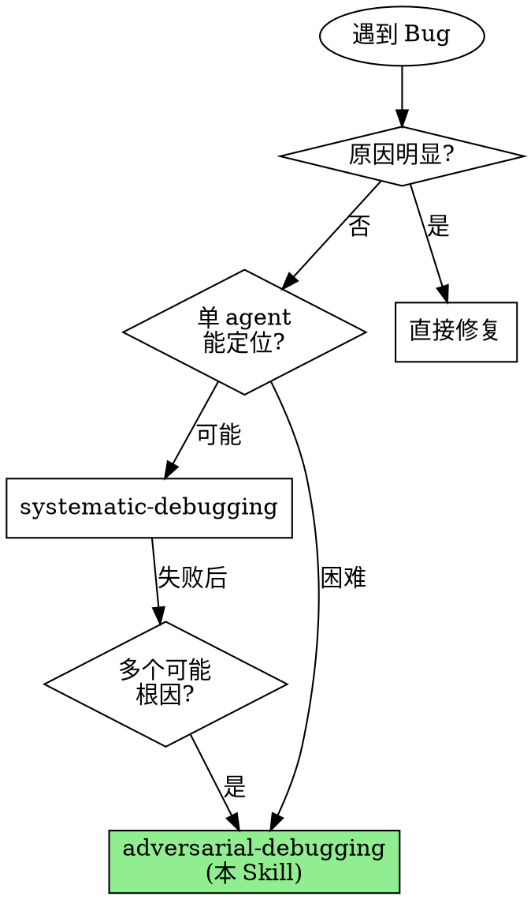

# Adversarial Debugging

**用多个 agent 的对抗辩论替代单 agent 的线性推理。**

实测数据：复杂 bug 中单 agent 首次假设正确率约 40%。对抗式调试通过并行调查 + 相互挑战，将根因定位准确率提升到 80%+。

Announce at start: "I'm using the adversarial-debugging skill to create an agent team that investigates competing hypotheses in parallel."

> **前置条件**: 需要启用 Agent Teams 实验性功能。
> 在 settings.json 中添加: `"env": { "CLAUDE_CODE_EXPERIMENTAL_AGENT_TEAMS": "1" }`

## When to Use



## vs. systematic-debugging

| 维度 | systematic-debugging | adversarial-debugging |
|------|---------------------|----------------------|
| Agent 数量 | 1 个 (顺序) | 3-7 个 (并行) |
| 假设处理 | 逐一测试 | 并行调查 + 辩论 |
| 偏见防御 | 流程纪律 | 结构化对抗 |
| 适合场景 | 常规 bug | 复杂/间歇性 bug |
| Token 消耗 | 低 | 高 (多 agent) |
| 速度 | 中等 | 快 (并行) |
| 准确率 | 高 | 更高 (多视角) |

## The 5-Phase Protocol

```
┌─────────────────────────────────────────────────────────────────┐
│                   ADVERSARIAL DEBUGGING                         │
├─────────────────────────────────────────────────────────────────┤
│                                                                 │
│  Phase 0: INTAKE            收集完整问题信息                      │
│           ↓                                                     │
│                                                                 │
│  Phase 1: HYPOTHESIZE       生成 3-5 个竞争假设                  │
│           ↓                 每个假设必须可证伪、独立              │
│                                                                 │
│  Phase 2: TEAM ASSEMBLY     创建 Agent Team                     │
│           ↓                 为每个假设分配调查员                  │
│                             + Devil's Advocate + Synthesizer    │
│                                                                 │
│  Phase 3: DEBATE            2-3 轮对抗辩论                       │
│           ↓                 调查 → 挑战 → 回应 → 综合            │
│                                                                 │
│  Phase 4: VERDICT & FIX     共识判定 + TDD 修复                  │
│                                                                 │
└─────────────────────────────────────────────────────────────────┘
```

---

## Phase 0: Problem Intake

**目的**: 收集足够信息以生成高质量假设

### 必须收集的信息

- [ ] **确切错误信息**: 完整的错误输出/堆栈跟踪
- [ ] **复现步骤**: 如何可靠地重现问题？
- [ ] **预期行为 vs 实际行为**: 应该发生什么？实际发生了什么？
- [ ] **最近更改**: 问题出现前改了什么？
- [ ] **环境信息**: 版本、操作系统、依赖版本
- [ ] **频率和模式**: 总是出现？偶尔？特定条件下？

### Detection Commands

```bash
# 获取完整错误信息
npm test 2>&1 | tee /tmp/error.log

# 查看最近更改
git log --oneline -10
git diff HEAD~5

# 环境信息
node -v && npm -v
```

**如果无法收集完整信息，停在这里，向用户提问。不要在信息不足时进入 Phase 1。**

---

## Phase 1: Hypothesis Generation

**目的**: 生成多个相互独立、可证伪的假设

### 假设生成规则

1. **独立性**: 假设之间不能互相依赖
2. **可证伪性**: 每个假设必须有可验证的预测
3. **覆盖性**: 假设应覆盖不同的故障维度
4. **数量**: 3-5 个（少于 3 个不够多元，多于 5 个浪费资源）

### 故障维度矩阵

| 维度 | 典型假设方向 |
|------|------------|
| 逻辑错误 | 条件判断、边界值、状态转换 |
| 并发问题 | 竞态条件、死锁、异步顺序 |
| 数据问题 | 输入验证、数据转换、编码 |
| 依赖问题 | 版本不兼容、API 变更、配置 |
| 环境问题 | 系统资源、权限、网络 |

### 假设模板

对每个假设填写：

```markdown
## Hypothesis #N: [简短标题]

**假设**: [如果 X，那么 Y]
**可证伪预测**: [如果假设正确，应该能观察到...]
**否定条件**: [如果发现 Z，则假设被否定]
**调查路径**: [从哪里开始调查]
**预估置信度**: X/10 (初始估计)
```

---

## Phase 2: Team Assembly & Parallel Investigation

**目的**: 创建 Agent Team 并启动并行调查

### Step 1: Create Team

使用 TeamCreate 创建调试团队：

```
TeamCreate:
  team_name: "adversarial-debug-[问题简称]"
  description: "Adversarial debugging: [问题描述]"
```

### Step 2: Create Tasks

为每个假设创建调查 task：

```
TaskCreate:
  subject: "Investigate: [假设标题]"
  description: |
    Hypothesis: [假设描述]
    Falsifiable Prediction: [可证伪预测]
    Investigation Path: [调查路径]
    Problem Context: [问题上下文]
```

另外创建辩论 task 和综合 task。

### Step 3: Spawn Teammates

为每个假设 spawn 一个 hypothesis-investigator：

```
Task (spawn teammate):
  subagent_type: "adversarial-debugger:hypothesis-investigator"
  team_name: "adversarial-debug-[问题简称]"
  name: "investigator-[假设编号]"
  prompt: |
    你被分配调查以下假设：
    [假设详情]

    问题背景：
    [Phase 0 收集的信息]

    调查后通过 SendMessage 向 team lead 报告发现。
```

Spawn Devil's Advocate：

```
Task (spawn teammate):
  subagent_type: "adversarial-debugger:devils-advocate"
  team_name: "adversarial-debug-[问题简称]"
  name: "devils-advocate"
  prompt: |
    你是本次调试的魔鬼辩护人。

    当前正在调查的假设：
    [所有假设列表]

    问题背景：
    [Phase 0 收集的信息]

    审查调查员的发现并挑战它们。
```

Spawn Evidence Synthesizer：

```
Task (spawn teammate):
  subagent_type: "adversarial-debugger:evidence-synthesizer"
  team_name: "adversarial-debug-[问题简称]"
  name: "evidence-synthesizer"
  prompt: |
    你是本次调试的证据综合员。

    正在调查的假设：
    [所有假设列表]

    跟踪所有证据，维护 Evidence Board，在辩论结束后给出判定。
```

### Step 4: Monitor Investigation

Lead 监控调查进展：
- 检查 TaskList 状态
- 确保调查员在推进
- 必要时提供额外上下文

---

## Phase 3: Adversarial Debate

**目的**: 通过结构化辩论筛选假设

### Debate Round Structure

每轮辩论包含：

```
1. INVESTIGATE (10-15 min)
   调查员深入调查，收集新证据
   ↓
2. REPORT
   调查员向 team 报告发现 (via SendMessage)
   ↓
3. CHALLENGE
   Devil's Advocate 审查并挑战 (via SendMessage → 调查员)
   ↓
4. RESPOND
   调查员用证据回应挑战 (via SendMessage → devil's-advocate)
   ↓
5. SYNTHESIZE
   Evidence Synthesizer 更新 Evidence Board
   向 Lead 报告状态
```

### Lead 的辩论管理职责

1. **每轮开始**: 确认所有 teammate 就绪
2. **每轮结束**: 检查 synthesizer 的状态报告
3. **假设淘汰**: 当 synthesizer 报告假设 ELIMINATED 时，通知相关调查员
4. **提前终止**: 如果出现强收敛（一个假设 >= 8/10），可以提前结束
5. **最大轮次**: 3 轮后强制进入 Phase 4

### 收敛条件

| 条件 | 动作 |
|------|------|
| 一个假设 >= 8/10 且所有挑战已回应 | 强收敛 → Phase 4 |
| 一个假设明显领先 (领先 >= 3 分) | 弱收敛 → 再一轮确认后 Phase 4 |
| 多个假设相近 | 继续辩论或让 synthesizer 强制判定 |
| 已达 3 轮 | 强制 → Phase 4 |

---

## Phase 4: Verdict & Fix

**目的**: 确定根因并实施修复

### Step 1: Collect Verdict

从 Evidence Synthesizer 收集最终判定报告。

### Step 2: Shutdown Team

```
SendMessage:
  type: "shutdown_request"
  recipient: [each teammate]
  content: "调试辩论结束，感谢参与。"
```

等待所有 teammate 确认后：

```
TeamDelete
```

### Step 3: Present Findings

向用户呈现：

```markdown
# Adversarial Debugging 结果

## 根因判定
**Root Cause**: [根因描述]
**Confidence**: X/10
**Evidence**: [关键证据摘要]

## 调查过程
- 假设总数: N
- 辩论轮次: M
- 被淘汰假设: K

## 被淘汰的假设
[为什么这些假设被排除]

## 推荐修复
[修复方向和具体建议]
```

### Step 4: TDD Fix (如用户要求)

确定根因后，使用 TDD 方式实施修复：
1. 写复现 bug 的测试
2. 确认测试失败
3. 实施最小修复
4. 确认测试通过 + 没有回归

---

## Anti-patterns

| 坏行为 | 为什么失败 | 正确做法 |
|--------|-----------|---------|
| 只生成 1-2 个假设 | 失去多元调查的优势 | 至少 3 个独立假设 |
| 假设不可证伪 | 无法被否定 = 无用 | 每个假设有明确否定条件 |
| Lead 自己调查 | 应该协调而非参与 | 使用 delegate mode |
| 跳过辩论直接判定 | 失去对抗的核心价值 | 至少 2 轮辩论 |
| 辩论超过 3 轮 | 收益递减 | 3 轮后强制判定 |
| 不清理 Team | 资源泄漏 | 辩论结束后 shutdown + cleanup |

## You Might Want to Skip This Skill

以下都不是有效理由：

| 借口 | 反驳 |
|------|------|
| "我知道 bug 在哪" | 单 agent 首次假设正确率只有 40% |
| "太贵了" | 3 小时随机修复 vs 30 分钟精准定位 |
| "这个 bug 很简单" | "简单"的 bug 最容易产生锚定效应 |
| "没时间组建团队" | Team 创建只需几秒 |
| "systematic-debugging 就够了" | 如果够了你就不会需要这个 skill |

## 与其他 Skill 的关系

```
adversarial-debugging (本 Skill)
      │
      ├── 调用 hypothesis-investigator agent (x3-5)
      ├── 调用 devils-advocate agent (x1)
      ├── 调用 evidence-synthesizer agent (x1)
      │
      ▼
  Root Cause Verdict
      │
      ▼
  test-driven-development (修复)
```

## Quick Reference Card

```
┌─────────────────────────────────────────────────────────────────┐
│                ADVERSARIAL DEBUGGING                             │
├─────────────────────────────────────────────────────────────────┤
│                                                                 │
│  Phase 0: INTAKE           收集错误信息 + 复现步骤               │
│                                                                 │
│  Phase 1: HYPOTHESIZE      生成 3-5 个独立可证伪假设             │
│                                                                 │
│  Phase 2: TEAM ASSEMBLY    TeamCreate + Spawn Teammates          │
│           ┌──────────────────────────────────────┐              │
│           │ Investigator-1  Investigator-2  ...  │              │
│           │ Devil's Advocate                     │              │
│           │ Evidence Synthesizer                 │              │
│           └──────────────────────────────────────┘              │
│                                                                 │
│  Phase 3: DEBATE           调查 → 挑战 → 回应 → 综合            │
│           (2-3 rounds)     收敛条件: ≥8/10 或 3轮后              │
│                                                                 │
│  Phase 4: VERDICT & FIX    共识报告 → Team Cleanup → TDD 修复   │
│                                                                 │
└─────────────────────────────────────────────────────────────────┘
```

## Core Principle

> **"A bug's root cause is not what you think it is — it's what survives the most rigorous challenge."**
>
> Bug 的根因不是你以为的那个——而是经受住最严格挑战后存活的那个。
