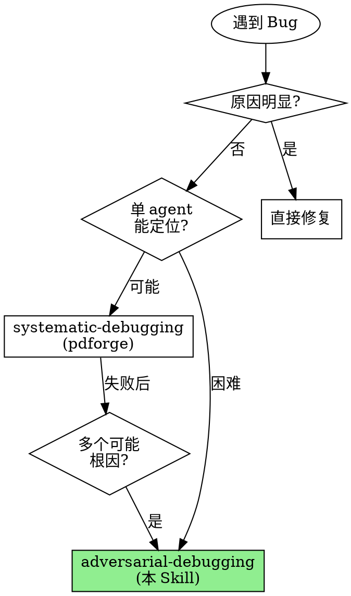

# Adversarial Debugging

**用多个 agent 的对抗辩论替代单 agent 的线性推理。**

实测数据：复杂 bug 中单 agent 首次假设正确率约 40%。对抗式调试通过并行调查 + 相互挑战，将根因定位准确率提升到 80%+。

Announce at start: "I'm using the adversarial-debugging skill to create an agent team that investigates competing hypotheses in parallel."

> **前置条件**: 需要启用 Agent Teams 实验性功能。
> 在 settings.json 中添加: `"env": { "CLAUDE_CODE_EXPERIMENTAL_AGENT_TEAMS": "1" }`

## When to Use



## vs. systematic-debugging (pdforge)

| 维度 | systematic-debugging | adversarial-debugging |
|------|---------------------|----------------------|
| Agent 数量 | 1 个 (顺序) | 3-7 个 (并行) |
| 假设处理 | 逐一测试 | 并行调查 + 辩论 |
| 偏见防御 | 流程纪律 | 结构化对抗 + 魔鬼辩护人 |
| 证据综合 | 个人判断 | 独立仲裁者评分 |
| 适合场景 | 常规 bug | 复杂/间歇性 bug |
| Token 消耗 | 低 | 高 (多 agent) |
| 速度 | 中等 | 快 (并行调查) |
| 准确率 | 高 | 更高 (多视角 + 对抗) |

## Integration with Forge Pipeline

```
Phase 5: Adversarial Review
      |
      |── 发现 bugs / 质量问题
      |
      ▼
Phase 6: Adversarial Debugging (本 Skill)
      |
      |── Root Cause 确定
      |── TDD Fix
      |
      ▼
  Fix 完成 → 回到 Phase 5 验证
```

### 触发来源

| 来源 | 输入 | 优先级 |
|------|------|--------|
| Phase 5 review 发现 | Review report + 问题描述 | 高 |
| 测试失败 | 测试日志 + 堆栈跟踪 | 高 |
| 用户报告 bug | 问题描述 + 复现步骤 | 中 |
| CI/CD 失败 | 构建日志 + 错误信息 | 高 |
| 间歇性故障 | 故障日志 + 出现模式 | 最高 |

## The 5-Phase Protocol

```
┌─────────────────────────────────────────────────────────────────┐
│                   ADVERSARIAL DEBUGGING                          │
├─────────────────────────────────────────────────────────────────┤
│                                                                  │
│  Phase 0: INTAKE            收集完整问题信息                      │
│           ↓                                                      │
│                                                                  │
│  Phase 1: HYPOTHESIZE       生成 3-5 个竞争假设                   │
│           ↓                 每个假设必须可证伪、独立               │
│                                                                  │
│  Phase 2: TEAM ASSEMBLY     创建 Agent Team                      │
│           ↓                 N investigators + DA + Synthesizer    │
│                                                                  │
│  Phase 3: DEBATE            2-3 轮对抗辩论                        │
│           ↓                 调查→报告→挑战→回应→综合               │
│                                                                  │
│  Phase 4: VERDICT & FIX     共识判定 + TDD 修复                   │
│                                                                  │
└─────────────────────────────────────────────────────────────────┘
```

---

## Phase 0: Problem Intake

**目的**: 收集足够信息以生成高质量假设

### 必须收集的信息

- [ ] **确切错误信息**: 完整的错误输出/堆栈跟踪
- [ ] **复现步骤**: 如何可靠地重现问题？
- [ ] **预期行为 vs 实际行为**: 应该发生什么？实际发生了什么？
- [ ] **最近更改**: 问题出现前改了什么？
- [ ] **环境信息**: 版本、操作系统、依赖版本
- [ ] **频率和模式**: 总是出现？偶尔？特定条件下？
- [ ] **来源信息**: 来自 Phase 5 review？用户报告？测试失败？

### Detection Commands

```bash
# 获取完整错误信息
npm test 2>&1 | tee /tmp/error.log

# 查看最近更改
git log --oneline -10
git diff HEAD~5

# 环境信息
node -v && npm -v

# 如果来自 Phase 5 review
cat docs/review/[review-report].md 2>/dev/null
```

**如果无法收集完整信息，停在这里，向用户提问。不要在信息不足时进入 Phase 1。**

---

## Phase 1: Hypothesis Generation

**目的**: 生成多个相互独立、可证伪的假设

### 假设生成规则

1. **独立性**: 假设之间不能互相依赖（互斥或正交）
2. **可证伪性**: 每个假设必须有可验证的预测和否定条件
3. **覆盖性**: 假设应覆盖不同的故障维度
4. **数量**: 3-5 个（少于 3 个不够多元，多于 5 个浪费资源）
5. **具体性**: 假设必须指向具体的代码/模块/机制

### 故障维度矩阵

| 维度 | 典型假设方向 | 调查技术 |
|------|------------|---------|
| 逻辑错误 | 条件判断、边界值、状态转换 | 代码走读、断言分析 |
| 并发问题 | 竞态条件、死锁、异步顺序 | 时序分析、锁检查 |
| 数据问题 | 输入验证、数据转换、编码 | 数据流追踪 |
| 依赖问题 | 版本不兼容、API 变更、配置 | 依赖分析、changelog |
| 环境问题 | 系统资源、权限、网络 | 环境对比 |
| 状态管理 | 状态污染、缓存失效、泄漏 | 状态追踪、内存分析 |

### 假设模板

对每个假设填写：

```markdown
## Hypothesis #N: [简短标题]

**假设**: [如果 X，那么 Y]
**可证伪预测**: [如果假设正确，应该能观察到...]
**否定条件**: [如果发现 Z，则假设被否定]
**调查路径**: [从哪里开始调查，具体的文件/模块]
**预估置信度**: X/10 (初始估计)
```

### 假设质量检查

```markdown
## Hypothesis Quality Check

[ ] 每个假设指向具体的代码位置或机制
[ ] 假设之间相互独立
[ ] 每个假设有明确的否定条件
[ ] 假设覆盖至少 2 个不同的故障维度
[ ] 数量在 3-5 个之间
```

---

## Phase 2: Team Assembly & Parallel Investigation

**目的**: 创建 Agent Team 并启动并行调查

### Step 1: Create Team

```
TeamCreate:
  team_name: "adversarial-debug-[问题简称]"
  description: "Adversarial debugging: [问题描述]"
```

### Step 2: Create Investigation Tasks

为每个假设创建调查 task：

```
TaskCreate:
  subject: "Investigate: [假设标题]"
  description: |
    Hypothesis: [假设描述]
    Falsifiable Prediction: [可证伪预测]
    Negation Condition: [否定条件]
    Investigation Path: [调查路径]
    Problem Context: [Phase 0 收集的信息]
```

### Step 3: Spawn Investigators

为每个假设 spawn 一个 hypothesis-investigator：

```
Task (spawn teammate):
  subagent_type: "forge-teams:hypothesis-investigator"
  team_name: "adversarial-debug-[问题简称]"
  name: "investigator-{N}"
  prompt: |
    你被分配调查以下假设：

    ## Hypothesis #{N}: [标题]
    假设: [描述]
    可证伪预测: [预测]
    否定条件: [条件]
    调查路径: [路径]

    ## Problem Context
    [Phase 0 的完整信息]

    ## Instructions
    1. 系统性调查假设
    2. 收集支持和否定的证据
    3. 通过 SendMessage 向 team lead 和 evidence-synthesizer 报告
    4. 当 devils-advocate 挑战你时，用证据回应
    5. 保持诚实 — 如果证据否定假设，直说
```

### Step 4: Spawn Devil's Advocate

```
Task (spawn teammate):
  subagent_type: "forge-teams:devils-advocate"
  team_name: "adversarial-debug-[问题简称]"
  name: "devils-advocate"
  prompt: |
    你是本次调试的魔鬼辩护人。

    ## Active Hypotheses
    [所有假设列表]

    ## Problem Context
    [Phase 0 的完整信息]

    ## Instructions
    1. 审查每个调查员的证据质量
    2. 寻找反证
    3. 通过 SendMessage 挑战调查员
    4. 对所有假设使用同等严格标准
    5. 挑战强度与调查员置信度成正比
    6. 向 evidence-synthesizer 报告挑战记录
```

### Step 5: Spawn Evidence Synthesizer

```
Task (spawn teammate):
  subagent_type: "forge-teams:evidence-synthesizer"
  team_name: "adversarial-debug-[问题简称]"
  name: "evidence-synthesizer"
  prompt: |
    你是本次调试的证据综合员和中立仲裁者。

    ## Active Hypotheses
    [所有假设列表]

    ## Problem Context
    [Phase 0 的完整信息]

    ## Scoring Matrix
    - Evidence Strength: 30%
    - Challenge Survival: 25%
    - Explanation Completeness: 20%
    - Parsimony: 15%
    - Verifiability: 10%

    ## Instructions
    1. 维护 Evidence Board
    2. 每收到证据或挑战记录时更新评分
    3. 每轮结束向 team lead 报告收敛状态
    4. 辩论结束时产出 Verdict 报告
```

---

## Phase 3: Adversarial Debate

**目的**: 通过结构化辩论筛选假设

### Debate Round Structure

每轮辩论包含 5 个阶段：

```
1. INVESTIGATE (调查员深入调查，收集新证据)
   ↓
2. REPORT (调查员向 team 报告发现 via SendMessage)
   ↓
3. CHALLENGE (Devil's Advocate 审查并挑战 via SendMessage → 调查员)
   ↓
4. RESPOND (调查员用证据回应挑战 via SendMessage → devil's-advocate)
   ↓
5. SYNTHESIZE (Evidence Synthesizer 更新 Evidence Board → Lead)
```

### Lead 的辩论管理职责

| 职责 | 操作 |
|------|------|
| 轮次启动 | 确认所有 teammate 就绪，宣布轮次开始 |
| 轮次结束 | 检查 synthesizer 的状态报告 |
| 假设淘汰 | 当 synthesizer 报告 ELIMINATED 时，通知调查员可以停止 |
| 提前终止 | 强收敛 (>= 8/10) 时可以提前结束 |
| 最大轮次 | 3 轮后强制进入 Phase 4 |
| 信息传递 | 确保挑战和回应在正确的 agent 之间传递 |

### 收敛条件

| 条件 | 类型 | 动作 |
|------|------|------|
| 一个假设 >= 8/10 且所有挑战已回应 | **强收敛** | 立即进入 Phase 4 |
| 一个假设明显领先 (领先 >= 3 分) | **弱收敛** | 再一轮确认后进入 Phase 4 |
| 多个假设分数相近 | **未收敛** | 继续辩论或让 synthesizer 设计区分测试 |
| 已达 3 轮辩论 | **强制收敛** | 选择最强假设，标注不确定性 |

### Lead 的辩论协调脚本

```
FOR round IN 1..3:
    1. 通知所有 agent: "Round {round} begins"

    2. 等待调查员提交 EVIDENCE REPORT
       → 转发给 devils-advocate 和 evidence-synthesizer

    3. 等待 devils-advocate 提交 CHALLENGE
       → 转发给对应调查员

    4. 等待调查员提交 CHALLENGE RESPONSE
       → 转发给 devils-advocate 和 evidence-synthesizer

    5. 等待 evidence-synthesizer 提交 STATUS UPDATE
       → 检查收敛条件

    IF 强收敛:
        BREAK → Phase 4

    IF 假设被 ELIMINATED:
        通知对应调查员: "你的假设已被淘汰，停止调查"
        SendMessage shutdown_request → 该调查员

END FOR
→ Phase 4 (强制收敛)
```

---

## Phase 4: Verdict & Fix

**目的**: 确定根因并实施修复

### Step 1: Collect Verdict

从 Evidence Synthesizer 收集最终判定报告。

### Step 2: Present Findings

向用户呈现结果：

```markdown
# Adversarial Debugging 结果

## 根因判定
**Root Cause**: [根因描述]
**Confidence**: X/10
**Location**: [文件:行号范围]

## 调查过程
- 假设总数: N
- 辩论轮次: M
- 被淘汰假设: K

## Scoring Summary
| Hypothesis | Score | Verdict |
|-----------|-------|---------|
| A | X.XX | WIN |
| B | Y.YY | ELIMINATED (Round 2) |
| C | Z.ZZ | ELIMINATED (Round 1) |

## 被淘汰的假设
### Hypothesis B: [描述]
**为什么被排除**: [原因]
**教训**: [从这个假设中学到什么]

## 推荐修复方向
**Fix Approach**: [修复方向]
**Risk Areas**: [风险点]
**Verification**: [验证方法]
```

### Step 3: Shutdown Team

```
1. SendMessage shutdown_request -> evidence-synthesizer
2. SendMessage shutdown_request -> devils-advocate
3. SendMessage shutdown_request -> investigator-1..N (如果还在运行)
4. 等待所有确认
5. TeamDelete
```

### Step 4: TDD Fix (如用户要求)

确定根因后，使用 TDD 方式实施修复：

```markdown
## TDD Fix Protocol

1. 写复现 bug 的测试
   → 运行测试确认失败（RED）

2. 实施最小修复
   → 只改根因，不做额外改动

3. 运行测试确认通过（GREEN）

4. 运行所有测试确认无回归

5. 清理调试代码

6. 提交修复
   → Commit: "fix: [根因描述]"
```

### Step 5: Integration with Phase 5

如果修复完成，结果可以回到 Phase 5 进行验证：

```
Phase 6 Fix → git commit → Phase 5 Re-review
                              ↓
                        Pass → 继续
                        Fail → 回到 Phase 6
```

---

## Anti-patterns

| 坏行为 | 为什么失败 | 正确做法 |
|--------|-----------|---------|
| 只生成 1-2 个假设 | 失去多元调查的优势 | 至少 3 个独立假设 |
| 假设不可证伪 | 无法被否定 = 无用 | 每个假设有明确否定条件 |
| 假设不独立 | 一个被否定全部倒塌 | 假设之间正交或互斥 |
| Lead 自己调查 | 应该协调而非参与 | 使用 delegate mode |
| 跳过辩论直接判定 | 失去对抗的核心价值 | 至少 2 轮辩论 |
| 辩论超过 3 轮 | 收益递减，成本增加 | 3 轮后强制判定 |
| 不清理 Team | 资源泄漏 | 辩论结束后 shutdown + cleanup |
| 修复前不写测试 | 无法验证修复 | TDD 修复：先写测试再修 |
| 忽视 synthesizer 评分 | 主观判断替代客观评估 | 使用评分矩阵做决策 |

## You Might Want to Skip This Skill

以下都不是有效理由：

| 借口 | 反驳 |
|------|------|
| "我知道 bug 在哪" | 单 agent 首次假设正确率只有 40% |
| "太贵了" | 3 小时随机修复 vs 30 分钟精准定位 |
| "这个 bug 很简单" | "简单"的 bug 最容易产生锚定效应 |
| "没时间组建团队" | Team 创建只需几秒 |
| "systematic-debugging 就够了" | 如果够了你就不会需要这个 skill |
| "修复比找根因快" | 不确定根因的修复只是在掩盖问题 |

## 与其他 Skill / Phase 的关系

```
Phase 5: Adversarial Review
      |
      |── 发现 bugs
      |
      ▼
adversarial-debugging (本 Skill = Phase 6)
      |
      |── 调用 hypothesis-investigator agent (x3-5)
      |── 调用 devils-advocate agent (x1)
      |── 调用 evidence-synthesizer agent (x1)
      |
      ▼
  Root Cause Verdict
      |
      ├── TDD Fix
      |
      ▼
  Fix 回到 Phase 5 验证
```

## Quick Reference Card

```
┌─────────────────────────────────────────────────────────────────┐
│                ADVERSARIAL DEBUGGING                             │
├─────────────────────────────────────────────────────────────────┤
│                                                                  │
│  Phase 0: INTAKE           收集错误信息 + 复现步骤                │
│                            来源: review / test / user report     │
│                                                                  │
│  Phase 1: HYPOTHESIZE      生成 3-5 个独立可证伪假设              │
│                            覆盖不同故障维度                       │
│                                                                  │
│  Phase 2: TEAM ASSEMBLY    TeamCreate + Spawn Teammates          │
│           ┌──────────────────────────────────────┐              │
│           │ Investigator-1  Investigator-2  ...  │              │
│           │ Devil's Advocate (opus)              │              │
│           │ Evidence Synthesizer (opus)          │              │
│           └──────────────────────────────────────┘              │
│                                                                  │
│  Phase 3: DEBATE           调查 → 挑战 → 回应 → 综合             │
│           (2-3 rounds)     收敛: >=8/10 或领先>=3 或 3轮后       │
│                                                                  │
│  Phase 4: VERDICT & FIX    Verdict Report → Team Cleanup         │
│                            → TDD Fix → 回到 Phase 5              │
│                                                                  │
│  Scoring Matrix:                                                │
│    Evidence Strength  30% | Challenge Survival 25%              │
│    Completeness       20% | Parsimony          15%              │
│    Verifiability      10%                                       │
│                                                                  │
└─────────────────────────────────────────────────────────────────┘
```

## Core Principle

> **"A bug's root cause is not what you think it is -- it's what survives the most rigorous challenge."**
>
> Bug 的根因不是你以为的那个——而是经受住最严格挑战后存活的那个。
> 对抗不是浪费——对抗是通往真相的最短路径。
