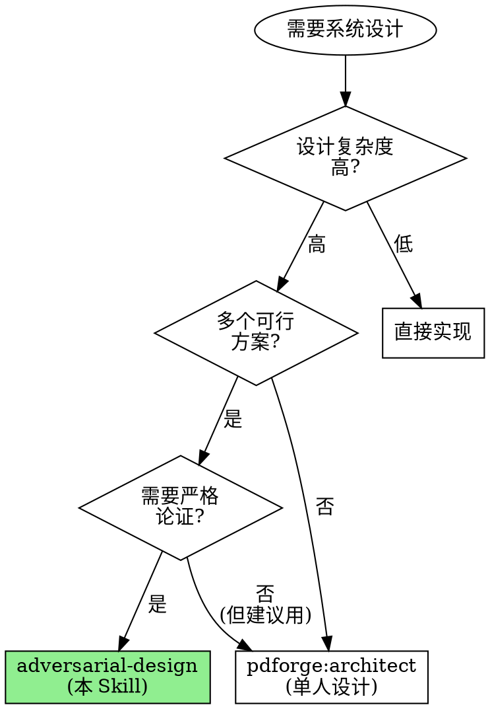

# Adversarial Design

**用多个架构师的竞争对抗替代单人设计的盲点。**

实测数据：单人架构设计的关键缺陷遗漏率约 30-50%。对抗式设计通过竞争提案 + 专职批评 + 中立仲裁，将架构缺陷在设计阶段暴露率提升到 80%+。

Announce at start: "I'm using the adversarial-design skill to create an agent team where multiple architects compete and a critic challenges their designs."

> **前置条件**:
> 1. PRD 文档已就绪（Phase 1 产出）
> 2. 需要启用 Agent Teams 实验性功能。
>    在 settings.json 中添加: `"env": { "CLAUDE_CODE_EXPERIMENTAL_AGENT_TEAMS": "1" }`

## When to Use



## vs. Single Architect (pdforge:architect)

| 维度 | pdforge:architect | adversarial-design |
|------|-------------------|-------------------|
| Agent 数量 | 1 个 | 4+ 个 (2 architect + 1 critic + 1 arbiter) |
| 设计方式 | 独立设计 | 竞争 + 对抗 + 仲裁 |
| 盲点防御 | 自我审查 | 专职评论家挑战 |
| 适合场景 | 常规功能设计 | 高风险/高复杂度架构决策 |
| 产出 | 单一架构文档 + ADR | 裁决文档 + 对比分析 + 淘汰记录 |
| Token 消耗 | 低 | 高 (多 agent 竞争) |
| 质量保证 | 中等 | 高 (多视角 + 对抗验证) |

## The 5-Phase Protocol

```
┌──────────────────────────────────────────────────────────────────────┐
│                      ADVERSARIAL DESIGN                              │
├──────────────────────────────────────────────────────────────────────┤
│                                                                      │
│  Phase 0: INTAKE               读取 PRD，理解需求和约束              │
│           ↓                                                          │
│                                                                      │
│  Phase 1: TEAM ASSEMBLY        创建 Agent Team                       │
│           ↓                    2 × solution-architect                │
│                                1 × technical-critic                  │
│                                1 × design-arbiter                   │
│                                                                      │
│  Phase 2: INDEPENDENT DESIGN   架构师独立设计 (并行)                 │
│           ↓                    不交流，各自产出完整方案               │
│                                                                      │
│  Phase 3: ADVERSARIAL DEBATE   2-3 轮对抗辩论                        │
│           ↓                    展示 → 挑战 → 回应 → 迭代             │
│                                                                      │
│  Phase 4: ARBITRATION          仲裁者评分裁决                         │
│                                获胜方案 + 合并改进 + 淘汰记录        │
│                                                                      │
└──────────────────────────────────────────────────────────────────────┘
```

---

## Phase 0: PRD Intake

**目的**: 确保有足够的需求信息启动架构设计

### 必须确认的信息

- [ ] **PRD 文档路径**: 完整的产品需求文档
- [ ] **功能需求清单**: 系统必须做什么
- [ ] **非功能需求**: 性能、可用性、安全性等约束
- [ ] **技术约束**: 必须使用/不能使用的技术
- [ ] **团队信息**: 团队规模、技术栈熟悉度
- [ ] **时间约束**: 项目截止日期

### Detection Commands

```bash
# 查找 PRD 文档
find . -name "*.md" | xargs grep -l -i "prd\|product.*requirement\|需求文档" 2>/dev/null

# 查找现有架构文档
find docs/ -name "*.md" 2>/dev/null | grep -i "arch\|design\|adr"

# 了解项目技术栈
cat package.json 2>/dev/null | head -50
cat requirements.txt 2>/dev/null
cat go.mod 2>/dev/null
ls -la src/ 2>/dev/null || ls -la app/ 2>/dev/null

# 项目结构
find . -maxdepth 3 -type d | grep -v node_modules | grep -v .git | head -40
```

**如果 PRD 不存在或信息不足，停在这里。使用 adversarial-requirements (Phase 1) 先生成 PRD。**

---

## Phase 1: Team Assembly

**目的**: 创建 Agent Team 并分配角色

### Step 1: Create Team

```
TeamCreate:
  team_name: "adversarial-design-[功能简称]"
  description: "Adversarial architecture design for [功能描述]"
```

### Step 2: Create Tasks

为每个角色创建任务：

```
# 架构师 A 的设计任务
TaskCreate:
  subject: "Design Proposal A: [功能名称]"
  description: |
    独立设计系统架构方案。
    PRD: [PRD 路径]
    Requirements: [关键需求摘要]
    Constraints: [技术约束]
    Focus: data model, API, component architecture, security

# 架构师 B 的设计任务
TaskCreate:
  subject: "Design Proposal B: [功能名称]"
  description: |
    独立设计系统架构方案（与 A 竞争）。
    PRD: [PRD 路径]
    Requirements: [关键需求摘要]
    Constraints: [技术约束]
    Focus: data model, API, component architecture, security

# 技术评论家的挑战任务
TaskCreate:
  subject: "Challenge all proposals: [功能名称]"
  description: |
    审查所有架构提案，从 6 个维度挑战。
    维度: scalability, SPOF, cost, complexity, tech risk, migration
    PRD: [PRD 路径]

# 仲裁者的裁决任务
TaskCreate:
  subject: "Arbitrate design competition: [功能名称]"
  description: |
    使用评分矩阵评判所有竞争方案，产出裁决。
    PRD: [PRD 路径]
```

### Step 3: Spawn Teammates

Spawn 2 个竞争架构师（sonnet 模型，节约 token）：

```
Task (spawn teammate):
  subagent_type: "forge-teams:solution-architect"
  team_name: "adversarial-design-[功能简称]"
  name: "architect-alpha"
  prompt: |
    你是架构师 Alpha。独立设计系统架构方案。

    PRD 路径: [PRD 路径]

    技术约束:
    [从 Phase 0 收集的约束]

    重要：
    1. 先读取 PRD 和现有代码库
    2. 产出完整架构文档（含数据模型、API、组件、安全、ADR）
    3. 通过 SendMessage 向 team lead 提交完整方案
    4. 准备回应 technical-critic 的挑战
```

```
Task (spawn teammate):
  subagent_type: "forge-teams:solution-architect"
  team_name: "adversarial-design-[功能简称]"
  name: "architect-beta"
  prompt: |
    你是架构师 Beta。独立设计系统架构方案。
    你在与 architect-alpha 竞争，但你不知道对方的设计。

    PRD 路径: [PRD 路径]

    技术约束:
    [从 Phase 0 收集的约束]

    重要：
    1. 先读取 PRD 和现有代码库
    2. 产出完整架构文档（含数据模型、API、组件、安全、ADR）
    3. 通过 SendMessage 向 team lead 提交完整方案
    4. 准备回应 technical-critic 的挑战
```

Spawn 技术评论家（opus 模型，需要深度分析能力）：

```
Task (spawn teammate):
  subagent_type: "forge-teams:technical-critic"
  team_name: "adversarial-design-[功能简称]"
  name: "technical-critic"
  prompt: |
    你是本次设计竞赛的技术评论家。

    PRD 路径: [PRD 路径]

    你将审查两个竞争的架构提案。
    使用 6 维度挑战方法论：scalability, SPOF, cost, complexity, tech risk, migration。

    等待 team lead 转发架构方案后开始挑战。
    每个挑战必须有严重度评级 (FATAL/CRITICAL/SIGNIFICANT/ADVISORY)。
    每个挑战必须包含建设性的替代建议。
```

Spawn 设计仲裁者（opus 模型，需要综合判断能力）：

```
Task (spawn teammate):
  subagent_type: "forge-teams:design-arbiter"
  team_name: "adversarial-design-[功能简称]"
  name: "design-arbiter"
  prompt: |
    你是本次设计竞赛的仲裁者。

    PRD 路径: [PRD 路径]

    你将在辩论结束后：
    1. 使用评分矩阵评估所有方案
    2. 考虑挑战存活率
    3. 寻找合并机会
    4. 产出裁决文档

    等待 team lead 通知辩论结束后开始评判。
```

### Step 4: Wait for Independent Design

确保两个架构师在 Phase 2 期间不交流。Lead 不要转发任何方案内容给另一个架构师。

---

## Phase 2: Independent Design (Parallel)

**目的**: 架构师独立设计，不受对方影响

### Lead 的职责

1. **隔离保证**: 不在两个架构师之间传递任何信息
2. **进度监控**: 检查两个架构师是否在推进
3. **材料提供**: 如果架构师需要额外信息（关于现有系统、约束等），及时回答
4. **不干预设计**: Lead 不对设计方案发表意见

### 完成标志

两个架构师都通过 SendMessage 提交了完整的架构文档，包含：
- [ ] 需求分析
- [ ] 数据模型
- [ ] API 设计
- [ ] 组件架构（含 Mermaid 图）
- [ ] 安全架构
- [ ] ADR（至少 2 个重大决策）
- [ ] 风险评估

---

## Phase 3: Adversarial Debate

**目的**: 通过结构化辩论暴露设计缺陷

### Debate Round Structure

每轮辩论包含 4 个步骤：

```
1. PRESENT (展示)
   Lead 将两个方案的摘要（非完整文档）共享给 technical-critic
   ↓
2. CHALLENGE (挑战)
   Technical critic 对每个方案发送挑战 (via SendMessage → architects)
   每个方案至少 3 个挑战，覆盖不同维度
   ↓
3. RESPOND (回应)
   架构师用证据回应挑战 (via SendMessage → technical-critic)
   可以修改设计以应对有效挑战
   ↓
4. ITERATE (迭代)
   评论家评估回应质量
   记录挑战存活状态
   向 Lead 报告本轮结果
```

### Lead 的辩论管理职责

1. **Round 1 (方向性审查)**:
   - 将方案摘要发给 technical-critic
   - 目标：寻找致命缺陷和方向性错误
   - 如果发现 FATAL 缺陷 → 通知架构师，给予修正机会

2. **Round 2 (深度审查)**:
   - 将更新后的方案发给 technical-critic
   - 目标：深入挑战核心决策
   - 架构师此时可以互相了解对方方案的摘要（促进竞争改进）

3. **Round 3 (最终审查) [可选]**:
   - 只在前两轮未充分收敛时进行
   - 目标：确认所有关键问题已回应
   - 如果仍有 FATAL 未解决 → 强制进入 Phase 4 但标记风险

### Convergence Conditions

| 条件 | 动作 |
|------|------|
| 两个方案都无 FATAL/CRITICAL 未解决 | 可以进入 Phase 4 |
| 一个方案有 FATAL 未解决 | 标记该方案为 FATALLY FLAWED → Phase 4 |
| 两个方案都有 FATAL | 考虑重新设计或允许第 3 轮修正 |
| 已完成 3 轮 | 强制进入 Phase 4 |
| 评论家报告无新发现 | 提前进入 Phase 4 |

---

## Phase 4: Arbitration & Verdict

**目的**: 产出最终裁决和合并后的架构文档

### Step 1: Prepare Materials for Arbiter

Lead 将以下材料发给 design-arbiter：

```
[ARBITRATION MATERIALS]
1. Proposal Alpha: [完整架构文档]
2. Proposal Beta: [完整架构文档]
3. Challenge Records: [每个方案的挑战记录和回应]
4. PRD: [PRD 文档路径]
5. Round Summary: [每轮辩论的摘要]
```

### Step 2: Wait for Verdict

Arbiter 使用评分矩阵评估后产出裁决文档。

### Step 3: Collect Verdict

从 design-arbiter 收集完整裁决文档。

### Step 4: Shutdown Team

```
SendMessage:
  type: "shutdown_request"
  recipient: [each teammate]
  content: "设计竞赛结束，感谢参与。"
```

等待所有 teammate 确认后：

```
TeamDelete
```

### Step 5: Present Results

向用户呈现最终结果：

```markdown
# Adversarial Design 结果

## 获胜方案
**Winner**: [方案名称] by [架构师名称]
**Score**: XX/100
**Confidence**: High/Medium/Low

## 竞赛过程
- 架构师数量: 2
- 辩论轮次: M
- 总挑战数: N
- 已解决挑战: K
- 致命缺陷: [数量和处理]

## 合并改进
[从落选方案中吸收的 X 个优秀设计元素]

## 最终架构
[获胜方案 + 合并改进后的架构概要]

## 被淘汰的备选方案
[为什么淘汰，什么条件下可重新考虑]

## 下一步
→ Phase 3 (Task Planning): 基于最终架构分解任务
→ Phase 4 (Parallel Implementation): 并行实施
```

---

## Anti-patterns

| 坏行为 | 为什么失败 | 正确做法 |
|--------|-----------|---------|
| 只 spawn 1 个架构师 | 失去竞争优势 | 至少 2 个独立方案 |
| 让架构师互相看方案 (Round 1) | 失去独立性 | Round 1 隔离设计 |
| 跳过 technical-critic | 缺少专职批评 | 必须有专职挑战者 |
| Lead 自己评判 | Lead 应协调不应裁判 | 使用 design-arbiter |
| 辩论超过 3 轮 | 收益递减 | 3 轮后强制裁决 |
| 不记录淘汰方案 | 未来重复讨论 | 完整记录淘汰理由 |
| 不清理 Team | 资源泄漏 | 裁决结束后 shutdown + cleanup |
| 没有 PRD 就开始 | 需求不明 = 设计无意义 | 先确保 PRD 就绪 |
| 仲裁不附理由 | 不可审查 | 每个评分附具体证据 |

## You Might Want to Skip This Skill

以下都不是有效理由：

| 借口 | 反驳 |
|------|------|
| "这个设计很简单" | "简单"设计最容易遗漏边界情况 |
| "我们已经知道怎么做了" | 已知方案不代表最优方案 |
| "太贵了" | 生产事故的修复成本远高于设计阶段的讨论成本 |
| "赶时间" | 错误的架构会让你浪费更多时间 |
| "单人设计就够了" | 30-50% 的缺陷遗漏率说明不够 |

## 与其他 Skill 的关系

```
Phase 1: adversarial-requirements
      │
      ▼ PRD 就绪
Phase 2: adversarial-design (本 Skill)
      │
      ├── 调用 solution-architect agent (x2)
      ├── 调用 technical-critic agent (x1)
      ├── 调用 design-arbiter agent (x1)
      │
      ▼
  Architecture Verdict + ADR
      │
      ▼
Phase 3: Task Planning
      │
      ▼
Phase 4: parallel-implementation
```

## Quick Reference Card

```
┌──────────────────────────────────────────────────────────────────────┐
│                    ADVERSARIAL DESIGN                                 │
├──────────────────────────────────────────────────────────────────────┤
│                                                                      │
│  Phase 0: INTAKE              读取 PRD + 理解约束                    │
│                                                                      │
│  Phase 1: TEAM ASSEMBLY       TeamCreate + Spawn Teammates           │
│           ┌────────────────────────────────────────────┐             │
│           │ Architect-Alpha    Architect-Beta          │             │
│           │ Technical Critic                           │             │
│           │ Design Arbiter                             │             │
│           └────────────────────────────────────────────┘             │
│                                                                      │
│  Phase 2: INDEPENDENT DESIGN  两个架构师并行独立设计                 │
│           (isolated)          不交流，各自产出完整方案               │
│                                                                      │
│  Phase 3: DEBATE              展示 → 挑战 → 回应 → 迭代             │
│           (2-3 rounds)        Round 1: 方向性 / Round 2: 深度        │
│                               收敛: 无 FATAL 或 3 轮后               │
│                                                                      │
│  Phase 4: ARBITRATION         评分矩阵 → 裁决 → 合并 → 淘汰记录     │
│                               Team Cleanup                           │
│                                                                      │
│  输出: Verdict + ADR + Merged Architecture + Eliminated Alternatives │
│                                                                      │
└──────────────────────────────────────────────────────────────────────┘
```

## Core Principle

> **"A design that hasn't been challenged is a design that hasn't been proven."**
>
> 没有被挑战过的设计，就是没有被证明过的设计。
