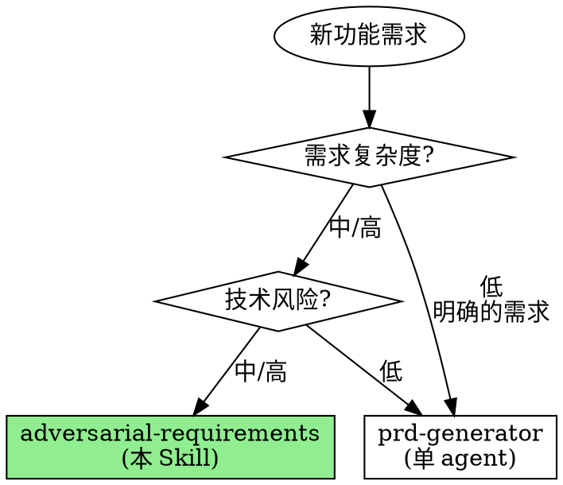

# Adversarial Requirements

**用两个 agent 的对抗辩论替代单人闭门造车的需求文档。**

实测数据：单人撰写的 PRD 平均有 3-5 个技术可行性盲点。对抗式需求通过产品倡导者 + 技术怀疑者的结构化辩论，将需求文档的技术可行性问题提前暴露，减少 60%+ 的实现阶段返工。

Announce at start: "I'm using the adversarial-requirements skill to create a battle-tested PRD through product-technical debate."

> **前置条件**: 需要启用 Agent Teams 实验性功能。
> 在 settings.json 中添加: `"env": { "CLAUDE_CODE_EXPERIMENTAL_AGENT_TEAMS": "1" }`

## When to Use



## vs. prd-generator (pdforge)

| 维度 | prd-generator | adversarial-requirements |
|------|--------------|------------------------|
| Agent 数量 | 1 个 | 2 个 (对抗) |
| 技术验证 | 自我验证 | 独立技术审查 |
| 偏见防御 | 标注假设 | 结构化挑战 |
| 适合场景 | 简单/明确需求 | 复杂/高风险功能 |
| Token 消耗 | 低 | 中 (两 agent) |
| 输出质量 | 高 | 更高 (经对抗检验) |
| 技术债务预防 | 中 | 高 |

## The 7-Step Protocol

```
┌─────────────────────────────────────────────────────────────────┐
│                   ADVERSARIAL REQUIREMENTS                       │
├─────────────────────────────────────────────────────────────────┤
│                                                                  │
│  Step 1: INTAKE             收集用户需求描述                       │
│          ↓                                                       │
│                                                                  │
│  Step 2: TEAM CREATE        创建 Agent Team                      │
│          ↓                  Product Advocate + Technical Skeptic  │
│                                                                  │
│  Step 3: ADVOCATE DRAFT     产品倡导者分析代码库 + 撰写 PRD 草案   │
│          ↓                                                       │
│                                                                  │
│  Step 4: SKEPTIC CHALLENGE  技术怀疑者分析代码库 + 挑战 PRD        │
│          ↓                                                       │
│                                                                  │
│  Step 5: DEBATE             倡导者回应 + 怀疑者再挑战 (2 轮)       │
│          ↓                                                       │
│                                                                  │
│  Step 6: SYNTHESIS          Lead 综合产出 battle-tested PRD       │
│          ↓                                                       │
│                                                                  │
│  Step 7: CLEANUP            Shutdown Team + 输出最终文档           │
│                                                                  │
└─────────────────────────────────────────────────────────────────┘
```

---

## Step 1: Problem Intake

**目的**: 收集足够的需求信息以启动对抗式分析

### 必须收集的信息

- [ ] **用户需求描述**: 功能的核心描述（文件或内联）
- [ ] **目标用户**: 谁会使用这个功能？
- [ ] **业务上下文**: 为什么需要这个功能？
- [ ] **技术约束**: 已知的技术限制？
- [ ] **时间约束**: 有 deadline 吗？
- [ ] **代码库位置**: 相关代码在哪里？

### 输入处理

```markdown
## Input Analysis

**Source**: [文件路径 / 内联描述]
**Completeness**: [High / Medium / Low]

**Extracted**:
  - Problem: [已识别 / 推断 / 缺失]
  - Users: [已识别 / 推断 / 缺失]
  - Features: [N] explicit, [M] implied
  - Constraints: [N] identified
  - Tech Context: [已分析 / 待分析]
```

**如果信息不足，向用户提问再继续。不要在信息不足时创建 Team。**

---

## Step 2: Team Assembly

**目的**: 创建 Agent Team 并准备辩论

### Create Team

```
TeamCreate:
  team_name: "adversarial-req-[功能简称]"
  description: "Adversarial requirements analysis: [功能描述]"
```

### Spawn Product Advocate

```
Task (spawn teammate):
  subagent_type: "forge-teams:product-advocate"
  team_name: "adversarial-req-[功能简称]"
  name: "product-advocate"
  prompt: |
    你是本次需求分析的产品倡导者。

    用户需求：
    [Step 1 收集的需求信息]

    代码库位置：
    [代码库根目录和相关目录]

    你的任务：
    1. 分析代码库理解技术上下文
    2. 撰写完整的 PRD 文档
    3. 通过 SendMessage 提交 PRD 给 team lead
    4. 等待 technical-skeptic 的挑战并回应

    PRD 保存路径: docs/prd/[feature-name]-prd.md
```

### Spawn Technical Skeptic

```
Task (spawn teammate):
  subagent_type: "forge-teams:technical-skeptic"
  team_name: "adversarial-req-[功能简称]"
  name: "technical-skeptic"
  prompt: |
    你是本次需求分析的技术怀疑者。

    用户需求：
    [Step 1 收集的需求信息]

    代码库位置：
    [代码库根目录和相关目录]

    你的任务：
    1. 深入分析代码库（架构、性能、安全、集成点）
    2. 等待 product-advocate 的 PRD 提交
    3. 基于代码库证据挑战 PRD
    4. 评估产品倡导者的回应

    注意：每个挑战必须有代码库中的具体证据支撑。
```

---

## Step 3: Advocate Draft

**目的**: 产品倡导者分析代码库并撰写 PRD 草案

### Lead 的职责

1. 确认 product-advocate 已开始工作
2. 等待 PRD 草案提交
3. 初步审查 PRD 完整性

### PRD 质量门控

收到 PRD 草案后，Lead 快速检查：

```markdown
## PRD Completeness Check

[ ] Executive Summary 存在
[ ] Problem Statement 清晰
[ ] User Stories 有 Acceptance Criteria
[ ] Success Metrics 使用 SMART
[ ] Functional Requirements 有优先级
[ ] Non-Functional Requirements 覆盖
[ ] Technical Considerations 基于代码库
[ ] Risks 已识别
[ ] Out of Scope 已定义
```

如果不完整，通过 SendMessage 要求 product-advocate 补充。

---

## Step 4: Skeptic Challenge

**目的**: 技术怀疑者基于代码库分析挑战 PRD

### Lead 的职责

1. 将 PRD 草案转发给 technical-skeptic（如果还没收到）
2. 确认 technical-skeptic 开始代码库分析和挑战
3. 等待挑战报告

### 挑战质量门控

收到挑战报告后，Lead 检查：

```markdown
## Challenge Quality Check

[ ] 每个挑战有代码库中的具体证据
[ ] 挑战分为 Critical / High / Medium / Low
[ ] 每个挑战有期望回应
[ ] 覆盖了技术可行性、性能、安全等维度
[ ] 不是空洞的质疑
```

如果挑战质量不足，要求 technical-skeptic 补充证据。

---

## Step 5: Adversarial Debate

**目的**: 通过结构化辩论产出经检验的需求

### 辩论结构 (2 轮)

```
Round 1:
  1. Lead 将挑战转发给 product-advocate
  2. Product advocate 回应每个挑战
     - ACCEPTED: 修改 PRD
     - PARTIALLY_ACCEPTED: 修改 + 解释权衡
     - REJECTED: 提供反驳证据
  3. Technical skeptic 评估回应
     - Adequate: 关闭挑战
     - Inadequate: 追加质疑或提出新挑战
  4. Lead 记录辩论结果

Round 2:
  1. Technical skeptic 基于修改后的 PRD 提出剩余/新挑战
  2. Product advocate 最终回应
  3. Technical skeptic 给出最终技术评估
  4. Lead 收集最终状态
```

### Lead 的辩论管理

| 情况 | 处理方式 |
|------|---------|
| 辩论陷入僵局 | Lead 做最终决策，记录理由 |
| 双方达成共识 | 记录共识，提前结束该挑战 |
| 需要更多技术分析 | 要求 skeptic 深入调查 |
| 需要更多用户洞察 | 要求 advocate 补充论证 |
| 挑战明显无效 | Lead 关闭挑战，说明原因 |

---

## Step 6: Synthesis

**目的**: Lead 综合辩论结果产出最终 PRD

### 综合流程

1. **收集所有辩论记录**
   - Product advocate 的 PRD 最终版
   - Technical skeptic 的最终评估
   - 所有挑战及其解决状态

2. **产出 Battle-Tested PRD**

```markdown
# Battle-Tested PRD: [Feature Name]

**Version**: 2.0 (Post-Adversarial Review)
**Created**: [Date]
**Status**: Adversarial Review Complete
**Authors**: product-advocate (draft), technical-skeptic (review), team-lead (synthesis)

---

## Adversarial Review Summary

### Debate Statistics
| Metric | Value |
|--------|-------|
| Challenges Issued | {N} |
| Challenges Resolved | {M} |
| PRD Sections Modified | {K} |
| Risk Items Added | {J} |

### Key Debates
1. **[争议点 1]**: [最终决策] — [理由]
2. **[争议点 2]**: [最终决策] — [理由]

### Technical Risk Annotations
[嵌入在 PRD 相关位置的技术风险标注]

---

[完整 PRD 内容，包含技术风险标注]
```

3. **添加技术风险标注**

在 PRD 的相关位置插入技术风险标注：

```markdown
> **Technical Risk [TR-001]**: [风险描述]
> **Severity**: [Critical/High/Medium/Low]
> **Mitigation**: [缓解措施]
> **Source**: Adversarial debate, Round {N}
```

---

## Step 7: Team Cleanup

**目的**: 清理团队资源并输出最终文档

### Shutdown Protocol

```
1. SendMessage shutdown_request -> product-advocate
   Content: "对抗式需求分析完成，感谢参与。"

2. SendMessage shutdown_request -> technical-skeptic
   Content: "对抗式需求分析完成，感谢参与。"

3. 等待所有 teammate 确认 shutdown

4. TeamDelete
```

### 最终输出

```markdown
# Adversarial Requirements 结果

## 文档位置
**PRD**: docs/prd/[feature-name]-prd.md

## 辩论摘要
- 挑战总数: {N}
- 已解决挑战: {M}
- PRD 修改次数: {K}
- 新增风险标注: {J}

## 技术可行性评估
**Overall**: [Feasible / Feasible with Conditions / Needs Revision]
**Key Conditions**:
1. [条件 1]
2. [条件 2]

## 下一步
1. Review: 审查 battle-tested PRD
2. Resolve: 处理剩余 Open Questions
3. Plan: 进入 Phase 2 (Adversarial Design) 或直接进入 Phase 3 (Planning)
```

---

## Anti-patterns

| 坏行为 | 为什么失败 | 正确做法 |
|--------|-----------|---------|
| 跳过代码库分析 | 挑战没有技术根基 | 双方都必须先分析代码库 |
| Advocate 不回应挑战 | 辩论变成独白 | 每个挑战必须有回应 |
| Skeptic 没有代码证据 | 空洞的质疑无效 | 每个挑战附代码位置和行号 |
| Lead 参与辩论 | 应该协调而非辩论 | Lead 只管理流程和做仲裁 |
| 超过 2 轮辩论 | 收益递减 | 2 轮后 Lead 做最终决策 |
| 不标注技术风险 | 辩论白做了 | 每个有效挑战都要在 PRD 中标注 |
| 不清理 Team | 资源泄漏 | 辩论结束后 shutdown + cleanup |
| PRD 没有验收标准 | 无法验证实现 | 每个 User Story 有 Acceptance Criteria |

## You Might Want to Skip This Skill

以下都不是有效理由：

| 借口 | 反驳 |
|------|------|
| "需求很简单" | "简单"的需求最容易隐藏技术债务 |
| "赶时间" | 实现阶段返工的时间 >> 需求辩论的时间 |
| "我们技术团队自己能评估" | 独立的技术挑战能发现团队盲点 |
| "PRD 只是形式" | 经检验的 PRD 是减少返工的最有效投资 |
| "太贵了" | 2 agent 对话 vs 实现阶段的大规模重构 |

## 与其他 Skill / Phase 的关系

```
adversarial-requirements (本 Skill = Phase 1)
      |
      |── 调用 product-advocate agent (x1)
      |── 调用 technical-skeptic agent (x1)
      |
      ▼
  Battle-Tested PRD
      |
      ▼
  Phase 2: Adversarial Design (adversarial-design)
      |
      ▼
  Phase 3: Planning
      |
      ▼
  Phase 4: Parallel Implementation (parallel-implementation)
```

## Quick Reference Card

```
┌─────────────────────────────────────────────────────────────────┐
│                ADVERSARIAL REQUIREMENTS                          │
├─────────────────────────────────────────────────────────────────┤
│                                                                  │
│  Step 1: INTAKE           收集用户需求 + 代码库位置               │
│                                                                  │
│  Step 2: TEAM CREATE      TeamCreate + Spawn 2 Teammates         │
│          ┌──────────────────────────────────────┐               │
│          │ Product Advocate (写 PRD)            │               │
│          │ Technical Skeptic (挑战 PRD)          │               │
│          └──────────────────────────────────────┘               │
│                                                                  │
│  Step 3: ADVOCATE DRAFT   分析代码库 → 撰写 PRD 草案             │
│                                                                  │
│  Step 4: SKEPTIC CHALLENGE 分析代码库 → 挑战 PRD                 │
│                                                                  │
│  Step 5: DEBATE (2 rounds) 回应 → 追加挑战 → 再回应 → 最终评估   │
│                                                                  │
│  Step 6: SYNTHESIS         Lead 综合 → Battle-Tested PRD         │
│                            + 技术风险标注                         │
│                                                                  │
│  Step 7: CLEANUP           Shutdown Team → 输出最终文档           │
│                                                                  │
└─────────────────────────────────────────────────────────────────┘
```

## Core Principle

> **"A PRD that hasn't been challenged is just a wish list. A PRD that survived adversarial review is a battle plan."**
>
> 没有经过挑战的 PRD 只是愿望清单。经过对抗审查存活的 PRD 才是作战计划。
