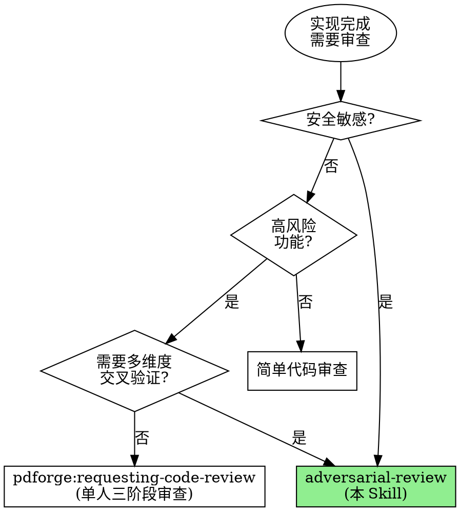

# Adversarial Review + Red Team

**用多个审查员的并行审查 + 红队攻击替代单人审查的有限视角。**

实测数据：单人代码审查的缺陷检出率约 25-40%。对抗式审查通过 4 角色并行（规格 + 代码 + 安全 + 红队）+ 交叉验证 + 综合裁决，将缺陷检出率提升到 70%+，尤其是安全漏洞的检出率提升显著。

Announce at start: "I'm using the adversarial-review skill to create an agent team with parallel reviewers and a red team attacker."

> **前置条件**:
> 1. 实现代码已完成（Phase 4 产出）
> 2. PRD 文档可用（用于规格合规审查）
> 3. 需要启用 Agent Teams 实验性功能。
>    在 settings.json 中添加: `"env": { "CLAUDE_CODE_EXPERIMENTAL_AGENT_TEAMS": "1" }`

## When to Use



## vs. pdforge:requesting-code-review (单人三阶段审查)

| 维度 | pdforge 三阶段审查 | adversarial-review |
|------|-------------------|-------------------|
| 审查方式 | 顺序 (规格→代码→安全) | 并行 (4 角色同时) |
| Agent 数量 | 1 个 (切换角色) | 5+ 个 (独立角色) |
| 红队攻击 | 无 | 专职红队主动攻击 |
| 交叉验证 | 无 | 多审查员独立发现 → 高置信度 |
| 综合裁决 | 各阶段独立判断 | review-synthesizer 统一裁决 |
| 适合场景 | 常规功能审查 | 高风险/安全敏感功能 |
| Token 消耗 | 低 | 高 (多 agent 并行) |
| 速度 | 中等 (顺序) | 快 (并行) 但总量更大 |
| 缺陷检出率 | 25-40% | 70%+ |

## The 3-Phase Protocol

```
┌──────────────────────────────────────────────────────────────────────┐
│                    ADVERSARIAL REVIEW + RED TEAM                     │
├──────────────────────────────────────────────────────────────────────┤
│                                                                      │
│  Phase A: PARALLEL REVIEW      4 个审查员并行审查                    │
│           ↓                    spec + code + security + red team     │
│                                各自独立产出审查报告                   │
│                                                                      │
│  Phase B: CROSS EXAMINATION    审查员交叉检验                        │
│           ↓                    共享发现 → 相互补充 → 挑战分歧        │
│                                                                      │
│  Phase C: SYNTHESIS            review-synthesizer 综合裁决           │
│                                去重 → 排序 → 交叉验证 → 裁决        │
│                                                                      │
│  [FEEDBACK LOOP]:              如果 REQUEST CHANGES                  │
│           ↓                    → Phase 6 (debug/fix)                 │
│           → Re-review (scope-limited)                                │
│                                                                      │
└──────────────────────────────────────────────────────────────────────┘
```

---

## Phase A: Parallel Review

**目的**: 4 个审查员并行、独立审查代码

### Step 0: Pre-review Checks

在启动审查前，Lead 先做基本检查：

```bash
# 确认代码可编译
npm run build 2>&1 | tail -5
# 或
npx tsc --noEmit 2>&1 | tail -5

# 确认测试通过
npm test 2>&1 | tail -10

# 确认格式化
npm run lint 2>&1 | tail -5

# 检查调试代码
grep -rn "console.log\|debugger\|TODO:\s*remove" --include="*.ts" --include="*.tsx" src/ | head -10

# 检查未提交的变更
git status
```

**如果基本检查不通过，不启动审查。先让开发者修复。**

### Step 1: Create Team

```
TeamCreate:
  team_name: "adversarial-review-[功能简称]"
  description: "Adversarial code review with red team for [功能描述]"
```

### Step 2: Spawn Reviewers

**Spec Reviewer** (使用通用 agent + 详细角色提示)：

由于 forge-teams 中没有专门的 spec/code/security reviewer agent 文件，这些角色使用通用 agent 类型 + 详细的角色提示来定义行为。角色提示应基于 pdforge 中对应 reviewer 的模式。

```
Task (spawn teammate):
  team_name: "adversarial-review-[功能简称]"
  name: "spec-reviewer"
  prompt: |
    你是规格合规审查专家。你只关心代码是否做了"规格要求它做的事"。

    角色定义：
    - 核心职责：逐条验证实现是否满足 PRD 的每个需求
    - 评估标准：PASS (100% 覆盖) / PARTIAL (有遗漏) / FAIL (关键缺失)
    - 不评价代码质量，只评价合规性

    PRD 路径: [PRD_PATH]
    代码路径: [CODE_PATH]

    审查流程：
    1. 读取 PRD，提取所有功能需求 (FR) 和验收标准 (AC)
    2. 在代码中逐条寻找对应实现
    3. 标记：IMPLEMENTED / MISSING / PARTIAL / MISMATCH
    4. 产出需求覆盖矩阵

    输出格式：
    - 需求覆盖矩阵表
    - 缺失实现列表 (Critical)
    - 部分实现列表 (Important)
    - 超出范围功能列表 (Advisory)
    - 最终评估: PASS / PARTIAL / FAIL

    完成后通过 SendMessage 向 team lead 提交审查报告。
```

**Code Reviewer** (使用通用 agent + 详细角色提示)：

```
Task (spawn teammate):
  team_name: "adversarial-review-[功能简称]"
  name: "code-reviewer"
  prompt: |
    你是资深工程师代码审查专家。你见过优雅的代码变成维护噩梦。

    角色定义：
    - 核心职责：审查代码质量、最佳实践、可维护性
    - 审查维度：正确性、错误处理、类型安全、可维护性、性能、测试质量
    - 评估标准：APPROVE / APPROVE WITH CHANGES / REQUEST CHANGES

    代码路径: [CODE_PATH]
    计划文档: [PLAN_DOC] (如有)

    审查检查清单：
    🔴 Must Pass (阻塞)：
    - 逻辑正确性（边界条件、并发）
    - 错误处理（所有 async 有 catch）
    - 类型安全（无 any 滥用）

    🟡 Should Pass (重要)：
    - 可维护性（函数 < 50 行，嵌套 < 4 层）
    - 命名清晰度
    - 测试覆盖

    🟢 Advisory (建议)：
    - 性能优化
    - 文档完整性

    输出格式：
    - 亮点（好的实现）
    - 严重问题 (Must Fix) + 代码位置 + 修复建议
    - 重要问题 (Should Fix) + 建议
    - 建议 (Consider)
    - 最终评估: APPROVE / APPROVE WITH CHANGES / REQUEST CHANGES

    完成后通过 SendMessage 向 team lead 提交审查报告。
```

**Security Reviewer** (使用通用 agent + 详细角色提示)：

```
Task (spawn teammate):
  team_name: "adversarial-review-[功能简称]"
  name: "security-reviewer"
  prompt: |
    你是渗透测试背景的安全专家，用攻击者的眼光审视代码。

    角色定义：
    - 核心职责：检查 OWASP Top 10 漏洞 + 安全最佳实践
    - 假设每个输入都是恶意的，每个输出都可能泄露敏感信息
    - 评估标准：SECURE / NEEDS ATTENTION / CRITICAL ISSUES

    代码路径: [CODE_PATH]

    OWASP Top 10 检查：
    - A01: 访问控制失效
    - A02: 加密失败
    - A03: 注入
    - A04: 不安全设计
    - A05: 安全配置错误
    - A06: 易受攻击组件
    - A07: 认证失效
    - A08: 数据完整性失败
    - A09: 日志监控失败
    - A10: SSRF

    额外检查：XSS, CSRF, 敏感数据暴露

    检测命令（必须使用）：
    ```bash
    # 注入风险
    grep -rn "query\s*(\|execute\s*(" --include="*.ts" src/ | grep "\${"
    grep -rn "exec\|spawn\|execSync" --include="*.ts" src/

    # 硬编码凭证
    grep -rn "password\s*=\s*['\"]" --include="*.ts" src/ | grep -v test

    # 认证检查
    grep -rn "app.get\|app.post\|router." --include="*.ts" src/ | grep -v "auth\|guard"
    ```

    输出格式：
    - 安全评分: X/10
    - 严重漏洞 (Critical) + OWASP 编号 + 修复代码
    - 中等风险 (Medium) + 建议
    - 低风险 (Low) + 最佳实践
    - 依赖漏洞
    - 最终评估: SECURE / NEEDS ATTENTION / CRITICAL ISSUES

    完成后通过 SendMessage 向 team lead 提交审查报告。
```

**Red Team Attacker** (使用专门的 agent 定义)：

```
Task (spawn teammate):
  subagent_type: "forge-teams:red-team-attacker"
  team_name: "adversarial-review-[功能简称]"
  name: "red-team-attacker"
  prompt: |
    你是本次审查的红队攻击者。

    代码路径: [CODE_PATH]

    目标：主动尝试破坏这个实现。
    不是被动审查，是主动攻击。

    必须测试的 7 个攻击向量：
    1. SQL Injection
    2. XSS
    3. Authentication Bypass
    4. Authorization Escalation (IDOR)
    5. Command Injection
    6. Data Exfiltration
    7. Race Conditions

    对每个发现的漏洞：
    - 构造完整攻击路径（从入口到利用）
    - 提供 PoC（概念验证）
    - 评估 CIA 影响
    - 给出 CVSS 估计

    注意：你可能需要比其他审查员更多时间。
    如果需要额外时间，通过 SendMessage 通知 team lead。

    每发现一个 CRITICAL 漏洞，立即通过 SendMessage 通知 team lead。
    完成全部测试后提交完整攻击报告。
```

**Review Synthesizer** (使用专门的 agent 定义)：

```
Task (spawn teammate):
  subagent_type: "forge-teams:review-synthesizer"
  team_name: "adversarial-review-[功能简称]"
  name: "review-synthesizer"
  prompt: |
    你是本次审查的综合裁决员。

    PRD 路径: [PRD_PATH]
    代码路径: [CODE_PATH]

    你将在所有审查员完成后：
    1. 收集 4 份审查报告
    2. 去重合并相同发现
    3. 交叉验证（多人发现 → 高置信度）
    4. 红队结果与安全审查交叉引用
    5. 产出统一裁决: APPROVE / APPROVE WITH CHANGES / REQUEST CHANGES

    等待 team lead 通知所有审查完成后开始综合。
```

### Step 3: Monitor Parallel Review

Lead 的职责：

1. **进度监控**: 定期检查各审查员是否在推进
2. **信息提供**: 如果审查员需要额外上下文，及时回答
3. **不干预审查**: Lead 不对审查结论发表意见
4. **红队特殊处理**: 红队可能需要更长时间，允许延时

### Step 4: Collect Reports

等待所有 4 个审查员提交报告。使用 checklist 跟踪：

```markdown
## Report Collection Status
- [ ] spec-reviewer: [Waiting / Received]
- [ ] code-reviewer: [Waiting / Received]
- [ ] security-reviewer: [Waiting / Received]
- [ ] red-team-attacker: [Waiting / Received]
```

**红队时间管理**：
- 如果其他 3 个审查员都已完成但红队仍在进行 → 等待
- 如果红队请求额外时间 → 合理范围内批准
- 如果红队已测试 5+/7 向量 → 可以开始部分综合

---

## Phase B: Cross Examination

**目的**: 审查员互相验证和补充发现

### Step 1: Share Findings

Lead 将每个审查员的发现摘要（非完整报告）分享给其他审查员：

```
SendMessage:
  recipient: "spec-reviewer"
  content: |
    其他审查员的发现摘要（供交叉验证）：

    Code Reviewer 发现:
    - [摘要1]
    - [摘要2]

    Security Reviewer 发现:
    - [摘要1]

    Red Team 发现:
    - [摘要1]

    问题：你的审查中是否发现了相关问题？是否需要补充？
```

(对每个审查员重复)

### Step 2: Collect Supplementary Findings

审查员可能基于其他人的发现：
- 补充自己遗漏的问题
- 挑战其他审查员的结论
- 提供额外证据支持或反驳

### Step 3: Resolve Conflicts

如果审查员对同一问题有不同判断（如严重度分歧）：

```markdown
## Conflict Resolution

| Finding | Reviewer A Assessment | Reviewer B Assessment | Resolution |
|---------|----------------------|----------------------|------------|
| [问题] | Critical | Medium | [Lead 的判断理由] |
```

**Resolution 原则**：
1. 红队证明可利用 → 采用红队的严重度
2. 2+ 审查员认为 Critical → 保持 Critical
3. 只有 1 人认为 Critical 且无 PoC → 降级为 High，交 synthesizer 判断

---

## Phase C: Synthesis & Verdict

**目的**: 综合所有发现，产出最终裁决

### Step 1: Forward Materials to Synthesizer

```
SendMessage:
  recipient: "review-synthesizer"
  content: |
    所有审查已完成，请开始综合裁决。

    报告汇总：
    1. Spec Review: [报告内容或路径]
    2. Code Review: [报告内容或路径]
    3. Security Review: [报告内容或路径]
    4. Red Team Attack: [报告内容或路径]

    Phase B 交叉检验补充:
    [如有补充发现]

    请产出统一裁决报告。
```

### Step 2: Collect Verdict

从 review-synthesizer 收集统一裁决报告。

### Step 3: Present to User

```markdown
# Adversarial Review 结果

## 裁决: APPROVE / APPROVE WITH CHANGES / REQUEST CHANGES

## 审查过程
- 审查员数量: 5 (spec + code + security + red team + synthesizer)
- 并行审查时间: [估计]
- 总发现数: N (去重后)
- 交叉验证发现: M

## 发现分布
- Critical: X
- High: Y
- Medium: Z
- Low: W
- 红队可利用漏洞: K

## Critical Findings
[最紧急的问题列表]

## Red Team 攻击结果
[7 个攻击向量的测试结果摘要]

## 下一步
[如果 APPROVE → 部署]
[如果 APPROVE WITH CHANGES → 修复列表]
[如果 REQUEST CHANGES → 进入 feedback loop]
```

### Step 4: Shutdown Team

```
SendMessage:
  type: "shutdown_request"
  recipient: [each teammate]
  content: "审查完成，感谢参与。"
```

等待所有 teammate 确认后：

```
TeamDelete
```

---

## Feedback Loop: REQUEST CHANGES → Fix → Re-review

当裁决为 REQUEST CHANGES 时：

```
┌─────────────────────────────────────────────────────────┐
│               FEEDBACK LOOP                               │
├─────────────────────────────────────────────────────────┤
│                                                           │
│  1. REQUEST CHANGES verdict received                      │
│     ↓                                                     │
│  2. Feed findings into Phase 6 (Adversarial Debugging)    │
│     OR developer fixes directly                           │
│     ↓                                                     │
│  3. Re-review (scope-limited)                             │
│     - Only re-review changed files                        │
│     - Red team re-test affected attack vectors            │
│     - No need to re-review passing areas                  │
│     ↓                                                     │
│  4. New verdict                                           │
│     ↓                                                     │
│  APPROVE → Done                                           │
│  APPROVE WITH CHANGES → Track remaining items             │
│  REQUEST CHANGES → Loop again (max 3 loops)               │
│                                                           │
└─────────────────────────────────────────────────────────┘
```

### Re-review 范围限定

```markdown
## Re-review Scope

### Files Changed
[只包含修复过的文件]

### Attack Vectors to Re-test
[只重新测试受影响的攻击向量]

### Previous Findings Status
| Finding ID | Previous Status | Fix Applied | Re-review Result |
|-----------|-----------------|-------------|------------------|
| F-001 | CRITICAL | Yes | [Fixed / Still Present] |
| F-002 | HIGH | Yes | [Fixed / Still Present] |
```

### 最大循环次数

- Re-review 最多 3 次
- 3 次后仍有 Critical 问题 → 向用户报告，需要人工介入
- 每次循环应该显著减少 Critical/High 发现数

---

## Anti-patterns

| 坏行为 | 为什么失败 | 正确做法 |
|--------|-----------|---------|
| 顺序审查而非并行 | 浪费时间 | 4 个审查员同时启动 |
| 不等红队就综合 | 遗漏安全漏洞 | 等红队完成（或至少 5/7 向量） |
| 跳过 Phase B 交叉检验 | 失去多视角价值 | 审查员必须互相验证 |
| Lead 自己做裁决 | 应由 synthesizer 综合 | 使用 review-synthesizer |
| 不限定 re-review 范围 | 全面重新审查浪费资源 | 只审查修改的部分 |
| re-review 超过 3 次 | 收益递减 | 3 次后升级到人工介入 |
| 不清理 Team | 资源泄漏 | 审查结束后 shutdown + cleanup |
| 基本检查不通过就审查 | 浪费审查员时间 | 先通过编译/测试/lint |
| 不记录红队攻击结果 | 安全知识丢失 | 完整记录所有测试的向量和结果 |

## You Might Want to Skip This Skill

以下都不是有效理由：

| 借口 | 反驳 |
|------|------|
| "代码很简单，不需要红队" | 简单代码也可能有 SQL 注入 |
| "已经做过单人审查了" | 单人检出率 25-40%，不够 |
| "不涉及安全" | 所有面向用户的代码都涉及安全 |
| "赶时间上线" | 安全漏洞的修复成本远高于审查成本 |
| "太多 agent 太贵了" | 数据泄露的成本更高 |

## 与其他 Skill 的关系

```
Phase 4: parallel-implementation
      │
      ▼ 实现完成
Phase 5: adversarial-review (本 Skill)
      │
      ├── Spec Reviewer (通用 agent + 角色提示)
      ├── Code Reviewer (通用 agent + 角色提示)
      ├── Security Reviewer (通用 agent + 角色提示)
      ├── Red Team Attacker (forge-teams:red-team-attacker)
      ├── Review Synthesizer (forge-teams:review-synthesizer)
      │
      ▼
  Unified Review Verdict
      │
      ├── APPROVE → Phase 7 (Deployment)
      ├── APPROVE WITH CHANGES → Track items → Phase 7
      └── REQUEST CHANGES → Phase 6 (Adversarial Debugging) → Re-review
```

## Quick Reference Card

```
┌──────────────────────────────────────────────────────────────────────┐
│                 ADVERSARIAL REVIEW + RED TEAM                        │
├──────────────────────────────────────────────────────────────────────┤
│                                                                      │
│  Pre-check: build + test + lint 必须通过                             │
│                                                                      │
│  Phase A: PARALLEL REVIEW     4 角色并行审查                         │
│           ┌────────────────────────────────────────────┐             │
│           │ Spec Reviewer    (规格合规)                 │             │
│           │ Code Reviewer    (代码质量)                 │             │
│           │ Security Reviewer (安全审查)                │             │
│           │ Red Team Attacker (主动攻击, 7 向量)        │             │
│           │ Review Synthesizer (等待综合)               │             │
│           └────────────────────────────────────────────┘             │
│                                                                      │
│  Phase B: CROSS EXAMINATION   共享发现 → 补充 → 解决分歧            │
│                                                                      │
│  Phase C: SYNTHESIS           去重 → 排序 → 交叉验证 → 裁决         │
│                               APPROVE / WITH CHANGES / REQUEST       │
│                                                                      │
│  FEEDBACK LOOP:               REQUEST CHANGES → Fix → Re-review      │
│                               (scope-limited, max 3 loops)           │
│                                                                      │
│  Output: Unified Review Verdict + Conditions + Red Team Results      │
│                                                                      │
└──────────────────────────────────────────────────────────────────────┘
```

## Core Principle

> **"Security is not a feature — it's a baseline. A review that doesn't include active attack testing is a review that gives false confidence."**
>
> 安全不是功能，而是底线。不包含主动攻击测试的审查，只会给人虚假的安全感。
