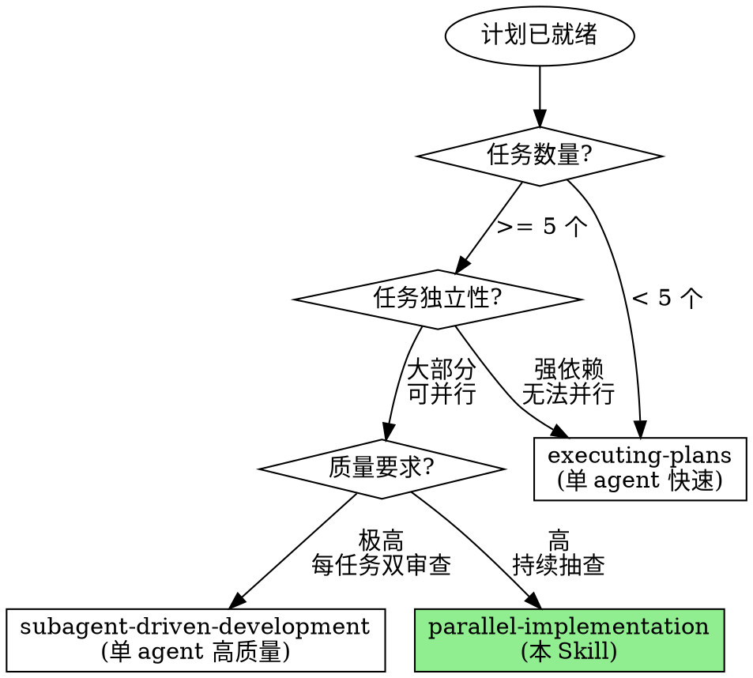

# Parallel Implementation

**用多个 agent 的并行实现替代单 agent 的顺序执行。**

实测数据：对于 15+ 个独立任务的计划，并行实现比顺序执行快 2-3x，同时通过 quality-sentinel 的持续抽查保持代码质量。

Announce at start: "I'm using the parallel-implementation skill to execute tasks in parallel with a team of implementers and quality sentinel."

> **前置条件**: 需要启用 Agent Teams 实验性功能。
> 在 settings.json 中添加: `"env": { "CLAUDE_CODE_EXPERIMENTAL_AGENT_TEAMS": "1" }`

## When to Use



## vs. Other Execution Skills

| 维度 | executing-plans | subagent-driven | parallel-implementation |
|------|----------------|-----------------|------------------------|
| Agent 数量 | 1 | 1 (多子代理) | N+1 (N implementers + 1 sentinel) |
| 并行度 | 顺序 | 顺序 | 并行 |
| 质量保证 | 检查点 | 每任务双审查 | 持续抽查 |
| 速度 | 快 | 慢 | 最快 |
| 适合任务数 | < 10 | < 15 | 10-50 |
| 文件冲突管理 | 不需要 | 不需要 | 需要 |
| Token 消耗 | 低 | 高 | 最高 |
| 适合场景 | MVP/快速 | 关键功能 | 大规模并行 |

## The Orchestration Protocol

```
┌─────────────────────────────────────────────────────────────────┐
│                   PARALLEL IMPLEMENTATION                        │
├─────────────────────────────────────────────────────────────────┤
│                                                                  │
│  Step 1: PLAN INTAKE       加载计划文档，提取任务列表              │
│          ↓                                                       │
│                                                                  │
│  Step 2: TASK ANALYSIS     分析任务依赖，划分并行组                │
│          ↓                 分配文件所有权                          │
│                                                                  │
│  Step 3: TEAM ASSEMBLY     TeamCreate                            │
│          ↓                 Spawn N implementers + 1 sentinel     │
│                                                                  │
│  Step 4: PARALLEL EXEC     Implementers 并行执行                  │
│          ↓                 Sentinel 持续抽查                      │
│          ↓                 Lead 协调和监控                         │
│                                                                  │
│  Step 5: CONVERGENCE       所有任务完成 → 最终验证                 │
│          ↓                                                       │
│                                                                  │
│  Step 6: CLEANUP           Shutdown Team → 输出实现报告            │
│                                                                  │
└─────────────────────────────────────────────────────────────────┘
```

---

## Step 1: Plan Intake

**目的**: 加载计划文档并提取可执行任务

### 从计划中提取

```bash
# 读取计划文档
cat docs/plans/[plan-file].md

# 或者从 JSON 格式的计划中提取
cat docs/plans/[plan-file].json | head -100
```

### 任务提取模板

对每个任务提取：

```markdown
## Task T{id}: {title}
**Description**: [任务描述]
**Files**: [涉及的文件列表]
**Dependencies**: [依赖的任务 ID]
**Verification**: [验证命令]
**Priority**: [P0/P1/P2]
**Estimated Complexity**: [Low/Medium/High]
```

---

## Step 2: Task Analysis & File Ownership

**目的**: 分析任务依赖关系并分配文件所有权

### 2.1 依赖分析

将任务分为并行组：

```markdown
## Parallel Execution Groups

### Group 1 (可立即执行)
- T001: [无依赖]
- T003: [无依赖]
- T005: [无依赖]

### Group 2 (依赖 Group 1)
- T002: [依赖 T001]
- T004: [依赖 T003]

### Group 3 (依赖 Group 2)
- T006: [依赖 T002, T004]
```

### 2.2 File Ownership Map

**关键规则**: 每个文件在同一时间只能有一个 owner。

```markdown
## File Ownership Map

| File | Owner | Task |
|------|-------|------|
| src/auth/middleware.ts | implementer-1 | T001 |
| src/auth/middleware.test.ts | implementer-1 | T001 |
| src/api/users.ts | implementer-2 | T003 |
| src/api/users.test.ts | implementer-2 | T003 |
| src/models/user.ts | implementer-3 | T005 |
| src/models/user.test.ts | implementer-3 | T005 |

### Shared Files (需要协调)
| File | Reason | Protocol |
|------|--------|----------|
| src/index.ts | 多任务需要注册路由 | 最后统一修改 |
| src/types/index.ts | 多任务需要添加类型 | 按顺序修改，不并行 |
```

### 2.3 Implementer 数量决策

| 并行任务数 | 推荐 Implementer 数 | 理由 |
|-----------|---------------------|------|
| 3-5 | 2 | 避免过多协调开销 |
| 6-10 | 3 | 平衡并行度和协调 |
| 11-15 | 4 | 每人 3-4 个任务 |
| 16-25 | 5 | 每人 4-5 个任务 |
| 25+ | 6 (最大) | 超过 6 个协调开销过大 |

**任务分配原则**: 每个 implementer 分配 5-6 个任务为最佳，相关文件的任务优先分给同一个 implementer。

---

## Step 3: Team Assembly

**目的**: 创建 Agent Team 并分配任务

### Create Team

```
TeamCreate:
  team_name: "parallel-impl-[功能简称]"
  description: "Parallel implementation: [功能描述]"
```

### Create TaskList

为每个任务创建 Task：

```
TaskCreate:
  subject: "T{id}: {title}"
  description: |
    ## Task Description
    {详细描述}

    ## File Ownership
    你被授权修改以下文件:
    - {file_1}
    - {file_2}

    ## Dependencies
    {依赖任务}

    ## Verification
    {验证命令}

    ## Acceptance Criteria
    - {标准 1}
    - {标准 2}
```

### Spawn Implementers

为每个 implementer 分配一组任务：

```
Task (spawn teammate):
  subagent_type: "forge-teams:team-implementer"
  team_name: "parallel-impl-[功能简称]"
  name: "implementer-{N}"
  prompt: |
    你是并行实现团队的 implementer-{N}。

    你的任务列表：
    [分配给你的任务 ID 和描述]

    你的文件所有权：
    [分配给你的文件列表]

    重要规则：
    1. 只修改分配给你的文件
    2. 遵循 TDD: RED → GREEN → REFACTOR → COMMIT
    3. 每个任务完成后通过 SendMessage 向 team lead 报告
    4. 如果需要修改不在你列表中的文件，先请求 lead 批准
    5. 如果遇到阻塞，立即报告 lead

    按任务 ID 顺序执行，但如果前一个被阻塞，可以跳到不依赖它的任务。
```

### Spawn Quality Sentinel

```
Task (spawn teammate):
  subagent_type: "forge-teams:quality-sentinel"
  team_name: "parallel-impl-[功能简称]"
  name: "quality-sentinel"
  prompt: |
    你是并行实现团队的质量哨兵。

    任务总数: {N}
    Implementers: {M}

    你的职责：
    1. 持续监控已完成任务的代码质量
    2. 对完成的代码进行抽查
    3. 发现问题时创建修复任务并通知 lead
    4. 不修改任何代码 — 你是只读角色

    质量检查重点：
    - 测试是否真正测试行为
    - 项目规范是否遵循
    - 调试代码是否残留
    - 错误处理是否完整
    - 类型安全是否维持
```

---

## Step 4: Parallel Execution (Lead = Delegate Mode)

**目的**: 协调并行执行，处理冲突和阻塞

### Lead 的职责（只协调，不实现）

```
┌─────────────────────────────────────────────────────────────────┐
│                                                                  │
│    Lead DELEGATE MODE                                            │
│                                                                  │
│    ✅ 允许：协调、分配、仲裁、监控                                 │
│    ❌ 禁止：自己写代码、自己修 bug、自己跑测试                     │
│                                                                  │
└─────────────────────────────────────────────────────────────────┘
```

### 监控循环

Lead 的监控流程：

```
WHILE 还有未完成任务:
    1. 检查 TaskList 状态
    2. 检查是否有 SendMessage 等待回应

    IF 收到 [TASK COMPLETED]:
        → 标记任务完成
        → 检查是否解锁了被阻塞的任务
        → 如果有解锁的任务，通知对应 implementer

    IF 收到 [BLOCKED]:
        → 分析阻塞原因
        → 如果是依赖阻塞：通知阻塞任务的 implementer 加速
        → 如果是文件冲突：重新分配文件所有权
        → 如果是技术问题：提供指导或重新分配任务

    IF 收到 [CONFLICT ALERT]:
        → 仲裁文件所有权
        → 更新 File Ownership Map
        → 通知相关 implementers

    IF 收到 [QUALITY ALERT]:
        → 评估问题严重性
        → 如果 Critical/High：创建修复任务并分配
        → 如果 Medium/Low：记录，后续处理

    IF implementer 长时间无响应:
        → SendMessage 询问状态
        → 如果仍无响应，考虑重新分配任务
```

### 文件冲突处理

| 冲突类型 | 解决方案 |
|---------|---------|
| 两个 implementer 需要同一文件 | 分配给一个，另一个等待或重新规划 |
| Implementer 需要未分配的文件 | Lead 分配所有权 |
| 共享配置文件修改 | 安排串行修改，最后一个 implementer 合并 |
| 合并冲突 | Lead 指导解决或分配专门的合并任务 |

### 任务重新分配

| 触发条件 | 处理方式 |
|---------|---------|
| Implementer 持续阻塞 | 将其未开始的任务重新分配 |
| Implementer 完成所有任务 | 分配其他 implementer 的任务 |
| 高优先级修复任务 | 分配给最空闲的 implementer |
| Quality sentinel 发现严重问题 | 分配修复任务给原 implementer |

---

## Step 5: Convergence

**目的**: 所有任务完成后的最终验证

### 完成条件

```markdown
## Convergence Checklist

[ ] 所有任务标记为完成
[ ] Quality sentinel 无 Critical/High 未解决问题
[ ] 所有修复任务已完成
[ ] 最终构建通过
[ ] 所有测试通过
[ ] 无合并冲突
```

### 最终验证

```bash
# 构建检查
npm run build 2>&1

# 全部测试
npm test 2>&1

# 类型检查
npm run type-check 2>&1

# Lint 检查
npm run lint 2>&1
```

如果最终验证失败：
1. 分析失败原因
2. 创建修复任务
3. 分配给最合适的 implementer
4. 重新验证

---

## Step 6: Team Cleanup & Report

**目的**: 清理团队资源并输出实现报告

### Shutdown Protocol

```
1. SendMessage shutdown_request -> quality-sentinel
   Content: "并行实现完成，感谢质量守望。"

2. SendMessage shutdown_request -> implementer-1..N
   Content: "并行实现完成，感谢参与。"

3. 等待所有 teammate 确认 shutdown

4. TeamDelete
```

### 实现报告

```markdown
# Parallel Implementation Report

## Overview
**Plan**: [计划文档路径]
**Feature**: [功能名称]
**Team Size**: {N} implementers + 1 quality sentinel

## Execution Summary
| Metric | Value |
|--------|-------|
| Total Tasks | {N} |
| Completed | {M} |
| Fix Tasks Created | {K} |
| Rework Count | {J} |
| File Conflicts Resolved | {C} |

## Implementer Performance
| Implementer | Tasks Assigned | Completed | Rework | Commits |
|------------|---------------|-----------|--------|---------|
| implementer-1 | {N} | {M} | {K} | {J} |
| implementer-2 | ... | ... | ... | ... |

## Quality Summary
**Spot Checks**: {N} tasks inspected
**Issues Found**: {M}
- Critical: {C}
- High: {H}
- Medium: {M}
- Low: {L}
**Quality Score Average**: X/10

## Test Results
**Total Tests**: {N}
**Passing**: {M}
**Failing**: {K}
**Coverage**: {X}%

## Commits
| Hash | Task | Description |
|------|------|-------------|
| abc123 | T001 | [commit message] |
| def456 | T003 | [commit message] |

## Timeline
[Start time] → [End time] = {duration}

## Issues Encountered
1. [问题 1]: [如何解决]
2. [问题 2]: [如何解决]

## Next Steps
1. Code Review (Phase 5)
2. Integration Testing
3. Deployment Preparation
```

---

## Anti-patterns

| 坏行为 | 为什么失败 | 正确做法 |
|--------|-----------|---------|
| Lead 自己写代码 | 角色混淆，失去协调能力 | Lead 只协调、分配、仲裁 |
| 不分配文件所有权 | 必然产生冲突 | 每个文件明确一个 owner |
| 一个 implementer 分配太多任务 | 瓶颈 | 每人 5-6 个任务为最佳 |
| 不 spawn quality sentinel | 质量无保障 | 永远包含 1 个 sentinel |
| 忽视阻塞报告 | implementer 空等 | 立即响应阻塞，重新分配 |
| 不做最终验证 | 集成问题遗漏 | 全部完成后运行完整验证 |
| 不清理 Team | 资源泄漏 | 完成后 shutdown + cleanup |
| 共享文件不做协调 | 合并冲突 | 共享文件串行修改 |

## You Might Want to Skip This Skill

以下都不是有效理由：

| 借口 | 反驳 |
|------|------|
| "任务太少不值得" | 5 个以上独立任务就有并行价值 |
| "协调成本太高" | 文件所有权机制将协调成本降到最低 |
| "质量不可控" | Quality sentinel 提供持续质量保障 |
| "不如一个人从头到尾" | 并行实现快 2-3x，质量不降低 |
| "太复杂了" | 本 skill 已封装所有协调逻辑 |

## 与其他 Skill / Phase 的关系

```
Phase 3: Planning
      |
      ▼
parallel-implementation (本 Skill = Phase 4)
      |
      |── 调用 team-implementer agent (xN)
      |── 调用 quality-sentinel agent (x1)
      |
      ▼
  Implementation Complete
      |
      ▼
Phase 5: Adversarial Review (adversarial-review)
      |
      ▼
Phase 6: Adversarial Debugging (if bugs found)
```

## Quick Reference Card

```
┌─────────────────────────────────────────────────────────────────┐
│                PARALLEL IMPLEMENTATION                           │
├─────────────────────────────────────────────────────────────────┤
│                                                                  │
│  Step 1: PLAN INTAKE      加载计划 → 提取任务列表                 │
│                                                                  │
│  Step 2: TASK ANALYSIS     依赖分析 + 文件所有权分配              │
│          ┌──────────────────────────────────────────┐           │
│          │  Group 1: T001, T003, T005 (并行)        │           │
│          │  Group 2: T002, T004       (依赖 G1)     │           │
│          │  Group 3: T006             (依赖 G2)     │           │
│          └──────────────────────────────────────────┘           │
│                                                                  │
│  Step 3: TEAM ASSEMBLY    TeamCreate                             │
│          ┌──────────────────────────────────────────┐           │
│          │  implementer-1  implementer-2  ...       │           │
│          │  quality-sentinel                        │           │
│          └──────────────────────────────────────────┘           │
│                                                                  │
│  Step 4: PARALLEL EXEC    Lead = DELEGATE MODE (只协调)          │
│          Implementers → TDD → Commit → Report                   │
│          Sentinel → Spot-check → Alert                          │
│          Lead → Monitor → Resolve Conflicts → Reassign          │
│                                                                  │
│  Step 5: CONVERGENCE      All tasks done → Final verification    │
│                                                                  │
│  Step 6: CLEANUP          Shutdown Team → Implementation Report  │
│                                                                  │
└─────────────────────────────────────────────────────────────────┘
```

## Core Principle

> **"Parallelism without coordination is chaos. Coordination without delegation is a bottleneck. This skill is both."**
>
> 没有协调的并行是混乱。没有委派的协调是瓶颈。本 Skill 两者兼备。
> 文件所有权 + TDD 纪律 + 质量抽查 = 快速且可靠的并行实现。
