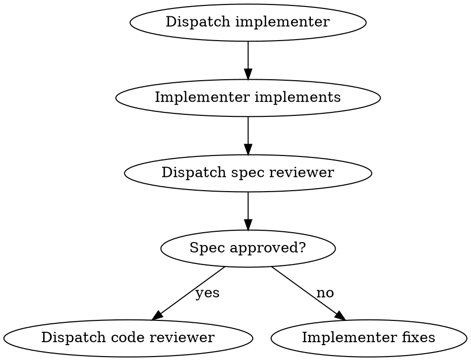
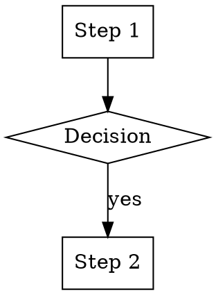
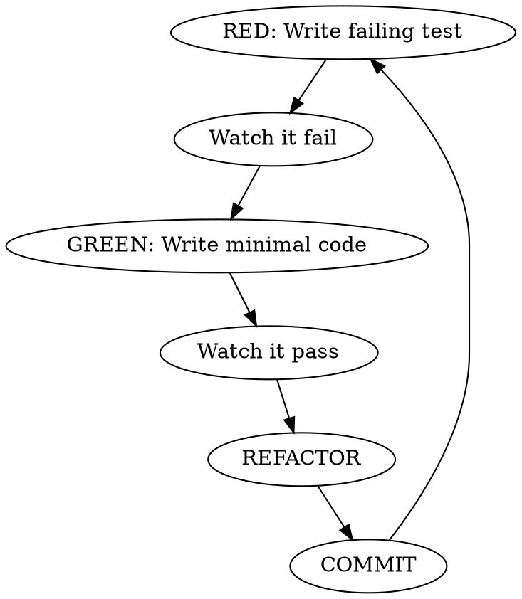

# Skill 创建准则

> PDForge 核心设计理念和最佳实践总结

---

## 一、什么是 Skill？

**本质**：一段被注入到当前对话的知识/指令，主 Agent 阅读后在**当前上下文**中执行。

**比喻**：你学会的**内化知识**。你查阅了一本手册，然后按照手册的方法继续你的工作。

```
┌─────────────────────────────────────┐
│           Main Agent                │
│  (有完整的对话历史和项目上下文)       │
│                                     │
│    invoke("test-driven-dev")        │
│         │                           │
│         ▼                           │
│  ┌─────────────────────────────┐    │
│  │   Skill 内容被注入上下文      │    │
│  │   主 Agent 继续执行          │    │
│  │   保留所有对话历史           │    │
│  └─────────────────────────────┘    │
│         │                           │
│         ▼                           │
│    主 Agent 按 Skill 指引继续工作   │
└─────────────────────────────────────┘
```

---

## 二、何时使用 Skill？

### 核心判断标准

| 问题 | 是 → Skill |
|------|------------|
| 需要了解当前对话的完整历史吗？ | ✅ |
| 是一个持续性的工作方式/规范吗？ | ✅ |
| 需要在工作过程中反复参考吗？ | ✅ |
| 需要融入当前上下文执行吗？ | ✅ |

### 典型使用场景

| 场景 | 原因 |
|------|------|
| **Brainstorming** | 需要了解用户的完整需求描述，是渐进式对话过程 |
| **Writing Plans** | 需要基于之前讨论的结论，了解项目约束 |
| **Test-Driven Development** | 是工作方式，需要在写代码时持续应用 |
| **Systematic Debugging** | 需要记住已尝试的方案，是迭代过程 |
| **Git Workflow** | 需要知道当前分支、改动，是持续参考的规范 |
| **Coding Standards** | 在写每一行代码时参考，是内化的知识 |

---

## 三、Skill 目录结构

PDForge 采用**目录驱动的 Skill 发现机制**：

```
skills/
├── test-driven-development/
│   ├── SKILL.md              # 必需：主技能文件
│   └── testing-anti-patterns.md  # 可选：参考文档
├── systematic-debugging/
│   ├── SKILL.md
│   ├── root-cause-tracing.md     # 技术文档
│   └── defense-in-depth.md
└── subagent-driven-development/
    ├── SKILL.md
    ├── implementer-prompt.md     # 子代理提示词
    └── spec-reviewer-prompt.md
```

**命名约定**：
- 目录和文件名使用 `hyphen-case`（连字符分隔小写字母）
- 技能名称采用**动名词形式**（verb + -ing），如 `writing-plans`、`test-driven-development`

---

## 四、SKILL.md 文件格式规范

### 4.1 Frontmatter（YAML 头）

```yaml
---
name: test-driven-development
description: Use when implementing features, fixing bugs, or refactoring. Triggers: 'write tests first', 'TDD', 'red-green-refactor'
---
```

### 4.2 Description 陷阱 ⚠️ 关键

**测试发现**：当 description 总结了工作流时，Claude 会直接按 description 执行而跳过阅读完整 skill 内容。

因此 description **只能描述触发条件**，不能包含工作流摘要：

| ❌ 错误示例 | ✅ 正确示例 |
|------------|------------|
| `Two-stage code review with spec then quality` | `Use when executing implementation plans with independent tasks` |
| `通过苏格拉底式问答澄清需求，探索替代方案` | `Use when designing new features. Triggers: "设计", "新功能"` |

---

## 五、Skill 类型分类

### 5.1 纪律强制型

需要**反合理化措施**阻止 AI 走捷径。

**代表**：`test-driven-development`

```markdown
## 铁律（Iron Law）
**NO CODE WITHOUT A FAILING TEST FIRST**
先测试失败，后写代码。没有例外。

## 红旗列表（反合理化）

| AI 可能的借口 | 回应 |
|--------------|------|
| "我已经手动测试过了" | 删除代码，从 TDD 重新开始 |
| "测试后置也能达到同样目的" | 违反字面意思即违反精神 |
| "这个情况不一样因为..." | 删除代码。删除意味着删除 |
```

### 5.2 技术技能型

描述具体技术方法和流程。

**代表**：`systematic-debugging`

```markdown
## 阶段流程

| 阶段 | 名称 | 核心要求 |
|------|------|----------|
| Phase 0 | 问题收集 | 先问问题，收集信息 |
| Phase 1 | 根因调查 | 禁止提前提出修复方案 |
| Phase 2 | 模式分析 | 分析模式和规律 |
| Phase 3 | 假设测试 | 一次只测试一个假设 |
| Phase 4 | TDD 修复 | 用 TDD 实现修复 |
```

### 5.3 协作模式型

定义多 Agent 交互流程。

**代表**：`subagent-driven-development`

```markdown
## 工作流


```

### 5.4 工作流型

定义任务流水线。

**代表**：`writing-plans`、`executing-plans`

---

## 六、SKILL.md 完整结构

```markdown
---
name: skill-name
description: Use when [触发条件]. Triggers: '[关键词1]', '[关键词2]'
---

# [Skill 名称]

**Core principle:** [一句话核心原则]

Announce at start: "I'm using the [skill-name] skill to [purpose]."

## When to use

- [触发场景 1]
- [触发场景 2]

## Workflow



## Checklist

- [ ] [必须完成的步骤 1]
- [ ] [必须完成的步骤 2]
- [ ] [验证步骤]

## Red flags (纪律强制型必需)

| 想法 | 现实 |
|------|------|
| "[AI 可能的借口]" | [为什么这是错误的] |

## Examples

### Good example
[正确使用示例]

### Bad example  
[错误使用示例及后果]
```

---

## 七、核心设计模式

### 7.1 渐进式加载（Progressive Disclosure）

**问题**：全量加载所有 Skill 消耗大量上下文

**解决方案**：
- 启动时只加载 frontmatter（~100 tokens/skill）
- 按需加载完整内容
- 15 个 Skills 可节省**数千 tokens**

### 7.2 流程图作为权威指令

使用 DOT/GraphViz 语法定义工作流：



Claude 可直接解释执行，比自然语言更精确。

### 7.3 反合理化架构 ⭐ 核心创新

**问题**：AI 会"找借口"绕过规则

**解决方案**：红旗列表 + 强制规则

| 传统方法 | Superpowers 方法 |
|----------|-----------------|
| "建议先写测试" | "先写代码？删除它。这不可协商。" |
| 列出好处让 AI 自行判断 | 红旗列表 + 现实反驳 + 强制规则 |

```markdown
## 你不能做的事

- "代码足够简单不需要测试" → 不。写测试。
- "我之后再添加测试" → 不。先测试。
- "这只是一个小改动" → 不。同样流程。

违反字面意思就是违反精神。
```

---

## 八、编写 Skill 的 TDD 方法

### Step 1：创建压力测试场景（RED）

```bash
# 启动新的 Claude Code 会话，不加载新 skill
# 给出会触发该 skill 的任务
# 记录 agent 的错误行为（基线）
```

### Step 2：加载 Skill 后测试（GREEN）

```bash
# 安装 skill
cp -r my-custom-skill ~/.config/opencode/skills/

# 重启会话，重复相同任务
# 验证 agent 现在正确遵循流程
```

### Step 3：修复漏洞（REFACTOR）

```bash
# 如果 agent 找到了绕过 skill 的借口
# 在红旗列表中添加该借口的反驳
```

**关键洞见**：如果不知道问题是什么，就无法确保 Skill 解决了正确的问题。

---

## 九、完整示例：test-driven-development

```markdown
---
name: test-driven-development
description: Use when implementing features, fixing bugs, or refactoring. Triggers: 'TDD', 'write tests', 'red-green-refactor'
---

# Test-Driven Development

**Core principle:** NO CODE WITHOUT A FAILING TEST FIRST

Announce at start: "I'm using the test-driven-development skill to ensure code quality through TDD."

## When to use

- Implementing new features
- Fixing bugs
- Refactoring existing code

## Workflow


## Checklist

- [ ] Test written before implementation
- [ ] Test fails for the right reason
- [ ] Minimal code written to pass
- [ ] All tests pass
- [ ] Code refactored (if needed)
- [ ] Committed

## Red flags

| Thought | Reality |
|---------|---------|
| "I've already tested it manually" | Delete code, start TDD from scratch |
| "Tests-after achieves the same" | Violating the letter is violating the spirit |
| "This case is different because..." | Delete. Delete means delete. |
| "Code is written, keep as reference" | Don't keep. Don't "adapt". Delete. |
| "It's too simple to need tests" | Simple code is easiest to test. Do it. |

## Key Rules

Write code before test? **Delete it.**
Don't keep it as "reference".
Don't "adapt" it while writing tests.
Delete means delete.

## Good example

```
User: "Add email validation to registration"
Agent: 
1. Write test: expect(validate("invalid")).toBe(false)
2. Run test → FAIL ✓
3. Write: return email.includes('@')
4. Run test → PASS ✓
5. Refactor if needed
6. Commit
```

## Bad example

```
User: "Add email validation"
Agent: 
1. Write validation function  ← WRONG: Code before test
2. "Now let me add tests..."  ← TOO LATE
```
```

---

## 十、Skill 级联依赖

Superpowers 的 Skill 形成完整流水线：

```
brainstorming (设计阶段)
     ↓
using-git-worktrees (创建隔离工作空间)
     ↓
writing-plans (创建详细计划)
     ↓
     ├── subagent-driven-development (当前会话，子代理驱动)
     │       └── test-driven-development
     │       └── requesting-code-review
     │
     └── executing-plans (并行会话，批量执行+检查点)
             └── test-driven-development
             └── requesting-code-review
     ↓
finishing-a-development-branch (合并/PR/保留/丢弃)
```

---

## 十一、检查清单

### Frontmatter
- [ ] name 使用 `hyphen-case`
- [ ] description **只包含触发条件**，不含工作流摘要
- [ ] description 包含 Triggers 关键词

### 结构
- [ ] 有核心原则（一句话）
- [ ] 有 "Announce at start" 声明
- [ ] 有 "When to use" 触发场景

### 工作流
- [ ] 使用 DOT 流程图定义（如适用）
- [ ] 有清晰的 Checklist
- [ ] 有 Good/Bad examples

### 反合理化（纪律强制型）
- [ ] 有红旗列表
- [ ] 覆盖常见借口
- [ ] 有明确的强制规则

### 测试
- [ ] 用 TDD 方法测试 Skill
- [ ] 记录了基线错误行为
- [ ] 验证了 Skill 有效性

---

## 十二、常见错误

| 错误 | 问题 | 改进 |
|------|------|------|
| Description 包含工作流摘要 | Claude 跳过完整内容 | 只写触发条件 |
| 没有反合理化设计 | AI 找借口绕过 | 添加红旗列表 |
| 没有流程图 | 工作流不清晰 | 使用 DOT 语法 |
| 没有 Good/Bad examples | 不知道正确行为 | 添加对比示例 |
| 没有测试 Skill | 不知道是否有效 | 用 TDD 方法测试 |
| 没有声明使用 | 用户不知道在用什么 | 添加 "Announce at start" |

---

## 十三、Skill vs Rules 区分

有时容易混淆 Skill 和 Rules，关键区别：

| 维度 | Skill | Rules |
|------|-------|-------|
| **内容** | 工作流程、步骤、方法论 | 约束、规范、模式 |
| **加载** | 通过 `use_skill` 注入 | 通过 `Read` 工具读取 |
| **时机** | 贯穿整个任务 | 任务开始前参考 |
| **示例** | test-driven-development | api-patterns, security-rules |

**选择准则**：
- 是"如何做"的方法 → **Skill**
- 是"做什么/不能做什么"的约束 → **Rules**

---

## 总结

**好的 Skill = 明确的触发 + 清晰的流程 + 反合理化保护**

```
┌─────────────────────────────────────────────────────────┐
│  Skill 设计四要素                                        │
│                                                         │
│  1. 触发 — 什么时候使用？(description 只写触发条件)       │
│  2. 流程 — 按什么步骤？(DOT 流程图)                      │
│  3. 检查 — 完成标准？(Checklist)                        │
│  4. 护栏 — 如何防止跳过？(红旗列表 + 强制规则)           │
│                                                         │
└─────────────────────────────────────────────────────────┘
```

**核心原则**：Skill 是"内化的方法"，需要上下文和持续参考的工作方式才用它。

**关键洞见**：**先测试 Agent 在没有 Skill 时的失败行为，再编写 Skill**——这是 Superpowers 成功的核心方法论。
