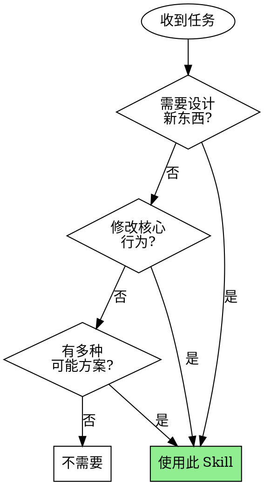

# Brainstorming Skill

## 核心原则

**在写任何代码前，通过结构化对话验证需求和方案。**

这个 Skill 防止的认知陷阱：收到需求后立即开始写代码，导致产出与预期偏差、大量返工。

## 何时使用



## 流程

### 阶段 1：侦察（静默执行，不输出）

在问任何问题之前，先：
- 阅读相关代码/文档，理解现有架构
- 识别受影响的模块和依赖
- 找出现有的设计模式和约定

**不允许在侦察前提问。** 侦察结果决定问题的质量。

### 阶段 2：发散探索

使用创意激发工具扩展可能性：

| 工具 | 用法 | 适用场景 |
|------|------|----------|
| **SCAMPER** | 替代/组合/调整/修改/挪用/消除/重排 | 改进现有功能 |
| **约束反转** | 如果 [限制] 不存在会怎样？ | 突破思维定式 |
| **类比迁移** | X 领域如何解决类似问题？ | 寻找新视角 |

探索 2-3 个显著不同的方案，不要过早收敛。

### 阶段 3：提问（每次只问一个）

规则：
- **每次只问一个问题**，等待回答后再问下一个
- **做推荐**：「我建议 X，因为 Y。这样可以吗？」
- **提供选项**：给出 2-3 个选项时标注推荐项

示例：
```
✅ "我建议用 React Query 管理状态，因为项目已有这个依赖且能自动处理缓存。可以吗？"

❌ "你想用什么状态管理？要支持离线吗？性能要求是什么？"
```

### 阶段 4：收敛呈现（分块输出）

呈现设计方案时：
- **每块 200-300 字**
- **等待明确确认后才继续**
- 应用 YAGNI 原则：只设计当前需要的

输出结构：
1. 问题定义（一句话）
2. 推荐方案 + 理由
3. 被否决的替代方案（简述为何否决）
4. 关键技术决策
5. 风险和缓解措施

### 阶段 5：文档

使用模板 `templates/design-doc.md`，保存到：`docs/designs/YYYY-MM-DD-<topic>.md`

文档必须包含：
- 完整的需求澄清记录（问题 + 回答 + 决策影响）
- 推荐方案及否决方案
- 明确的范围边界（In Scope / Out of Scope）
- 可测量的成功指标
- 开放问题（如有）

### 阶段 6：交接

完成后：

1. 确认设计文档已保存
2. 输出交接提示：
   ```
   ✅ 需求澄清完成
   
   📄 设计文档: docs/designs/YYYY-MM-DD-<topic>.md
   
   📋 下一步选择:
      • 生成 PRD: /prd docs/designs/<file>.md
   ```
3. **不要自行开始写代码或生成 PRD**

## 反模式

| 坏行为 | 为什么失败 | 正确做法 |
|--------|-----------|---------|
| 一次问多个问题 | 用户挑简单的答，跳过复杂的 | 每次一个 |
| 跳过侦察直接问 | 问题通用且无关 | 先读代码再问 |
| 一次性输出完整设计 | 用户草草确认「应该没问题」 | 分块 200-300 字 |
| 推卸判断给用户 | 浪费人类时间 | 做推荐 |
| 过早收敛到第一个方案 | 错过更好的可能性 | 先发散后收敛 |
| 澄清完直接写代码 | 跳过 PRD 导致任务分解混乱 | 必须先生成 PRD |

## 你可能想跳过这个 Skill

以下都不是有效理由：

| 借口 | 反驳 |
|------|------|
| 「我已经知道怎么做了」 | 知道概念 ≠ 与用户对齐 |
| 「这个很简单」 | 简单的事更容易假设错误 |
| 「用户很急」 | 返工比多花 5 分钟更慢 |
| 「我的方法也能用」 | 能用 ≠ 是用户想要的 |
| 「先写出来看看」 | 这正是导致返工的原因 |
| 「这次是特例」 | 没有特例 |
| 「设计文档够详细了，可以直接写代码」 | 没有 PRD 和任务分解，实现会偏离 |

**如果 Skill 存在，你必须使用。没有例外。**

## 与下游流程的关系

```
brainstorming (本 Skill)
      │
      ▼
  design-doc.md ──────────────────────┐
      │                               │
      ▼                               ▼
   /prd ───────→ PRD ───→ /plan ───→ tasks
```

**注意**：brainstorming 产出的 design-doc 是 prd-generator 的**高质量输入之一**，但 prd-generator 也能处理其他格式的输入。

## 资源

- `templates/design-doc.md` - 设计文档模板
- `references/creative-tools.md` - 创意激发工具详解
- `references/question-patterns.md` - 高质量提问模式