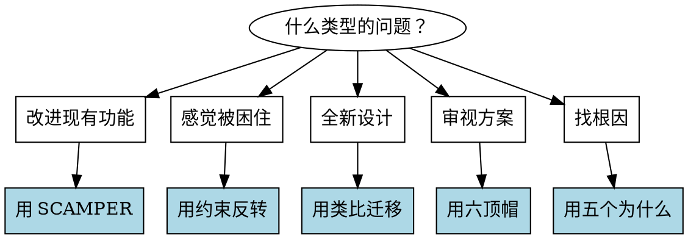

# 创意激发工具详解

> 按需加载，不占用主 Skill 的 token 预算

---

## 1. SCAMPER 框架

当需要改进或重新思考现有功能时使用。

| 字母 | 含义 | 引导问题 |
|------|------|----------|
| **S** Substitute | 替代 | 什么可以被替换？用其他材料/流程/人？ |
| **C** Combine | 组合 | 可以与什么合并？功能/流程/目的？ |
| **A** Adapt | 调整 | 可以从什么借鉴？其他领域的解法？ |
| **M** Modify | 修改 | 可以放大/缩小/改变什么属性？ |
| **P** Put to other uses | 挪用 | 还能用在什么场景？ |
| **E** Eliminate | 消除 | 可以删除什么？简化什么？ |
| **R** Reverse/Rearrange | 重排 | 可以颠倒/重组什么顺序？ |

### 使用示例

```
任务：改进文件上传功能

S - 替代：用拖拽替代点击选择？
C - 组合：上传和预览合并为一步？
A - 调整：借鉴 Figma 的协作上传模式？
M - 修改：支持批量上传？限制单文件大小？
P - 挪用：上传组件能复用到其他场景吗？
E - 消除：必须有进度条吗？必须确认吗？
R - 重排：先预览再确认上传？
```

---

## 2. 约束反转法

当感觉被现有限制困住时使用。

### 步骤

1. 列出当前的限制/假设
2. 逐一假设「如果这个限制不存在会怎样？」
3. 从理想状态反推可行方案

### 常见约束类型

| 约束类型 | 反转问题 |
|----------|----------|
| 技术限制 | 如果性能无限会怎么设计？ |
| 资源限制 | 如果有无限预算/人力呢？ |
| 时间限制 | 如果不赶 deadline 会怎么做？ |
| 兼容性 | 如果可以 breaking change 呢？ |
| 用户习惯 | 如果用户愿意重新学习呢？ |

### 使用示例

```
任务：优化搜索性能

当前限制：必须兼容旧 API
反转问题：如果可以重新设计 API 会怎样？
发现：新 API 可以支持增量搜索，旧 API 可以做适配层
结论：先设计理想 API，再加兼容层
```

---

## 3. 类比迁移法

当陷入行业思维定式时使用。

### 步骤

1. 抽象出问题的本质（不用行业术语）
2. 找到其他领域的类似问题
3. 研究那些领域的解法
4. 迁移适用的思路

### 跨领域类比库

| 软件问题 | 类比领域 | 启发 |
|----------|----------|------|
| 缓存失效 | 图书馆管理 | 借阅热度决定上架位置 |
| 负载均衡 | 超市收银 | 动态开关通道 |
| 版本控制 | 法律修订 | 增量修正案 vs 全文重发 |
| 权限系统 | 酒店门卡 | 分层授权 + 时效性 |
| 消息队列 | 邮局系统 | 分拣、投递、签收 |

---

## 4. 六顶思考帽（简化版）

当需要多角度审视方案时使用。

| 帽子 | 视角 | 问题 |
|------|------|------|
| 🎩 白帽 | 事实 | 我们知道什么？不知道什么？ |
| 🎩 黄帽 | 乐观 | 最好情况是什么？有什么好处？ |
| 🎩 黑帽 | 批判 | 有什么风险？可能失败的原因？ |
| 🎩 绿帽 | 创意 | 还有什么替代方案？ |
| 🎩 蓝帽 | 控制 | 下一步是什么？如何推进？ |

> 注：红帽（情感）在技术讨论中通常省略

---

## 5. 五个为什么（5 Whys）

当需要挖掘问题根因时使用。

### 示例

```
问题：用户抱怨导出太慢

为什么慢？→ 导出时要重新渲染所有节点
为什么要重新渲染？→ 导出格式和显示格式不同
为什么不同？→ 显示用 Canvas，导出用 SVG
为什么不统一？→ 历史原因，当时 Canvas 性能更好
为什么现在不改？→ 没人意识到这是根因

根因：渲染架构不统一
解法：统一渲染层，或增加渲染缓存
```

---

## 6. 使用建议

### 工具选择决策树



### 组合使用

复杂问题可以组合多个工具：

1. **5 Whys** 找到根因
2. **约束反转** 打开思路
3. **SCAMPER** 生成选项
4. **六顶帽** 评估方案
