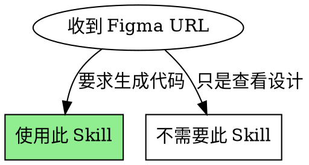
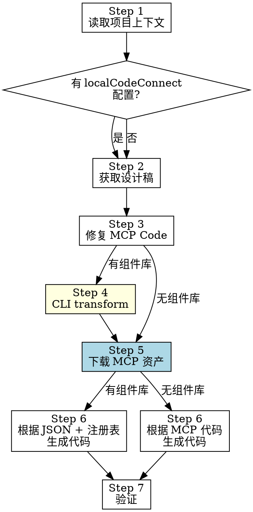

# Figma to Code

## 核心原则

**使用项目组件库生成代码，而非 Figma MCP 的原始输出。** MCP 返回的代码有语法问题且不使用项目组件，必须经过修复和转换。

## 前提条件

1. **Figma MCP 已连接**
2. **可选**：项目配置了 local-code-connect（有组件库时）
   - `package.json` 中有 `localCodeConnect.registry` 配置
   - 或项目内存在 `.figma-registry.json` 文件（通过 glob 搜索发现）
   - 组件库已导出注册表文件
3. **强烈推荐**：Figma API Token（用于获取完整组件属性）
   - 环境变量 `FIGMA_TOKEN` 或 CLI `--figma-token`
   - 或项目 `.env` 文件中定义 `FIGMA_TOKEN=figd_xxx`
   - **没有 Token 时约 60% 的组件 props 会为空**，严重影响代码准确性
   - MCP 不返回组件 variant/boolean 属性值，REST API 能补全

## 何时使用



## 流程概览



**标注说明**：
- **黄色**：Step 4 仅在有组件库时执行
- **蓝色**：Step 5 下载资产是必须步骤，所有流程都要执行

## 流程

**必须按顺序执行，不允许跳过任何步骤。**

### Step 1: 读取项目上下文

在调用任何 Figma MCP 之前：

#### 1a. 发现组件注册表

按优先级依次检查，**任一方式找到即可**：

1. **读取 `package.json`**，检查 `localCodeConnect.registry` 配置
2. **如果第 1 步未找到**：用 glob 搜索项目内的 `**/.figma-registry.json` 文件
3. **如果找到注册表**：读取它，了解可用组件及其 props

```json
// package.json 配置示例（可选，但推荐）
{
  "localCodeConnect": {
    "registry": "./node_modules/@xrs/vue/dist/.figma-registry.json"
  }
}
```

> **为什么需要 glob 兜底？** 很多项目没有在 `package.json` 中显式配置，但组件库的 build 产物中已经包含了 `.figma-registry.json`。例如本项目的 `packages/vue/.figma-registry.json`。

#### 1b. 发现 FIGMA_TOKEN

**这一步至关重要。** 没有 Token 时，组件 props 会大量缺失（约 60%），导致生成的代码与设计稿严重不符。

按优先级依次检查：

1. 检查 `process.env.FIGMA_TOKEN`（shell 环境变量）
2. **如果第 1 步未找到**：读取项目根目录的 **`.env` 文件**，解析 `FIGMA_TOKEN=xxx` 行
3. **如果第 2 步未找到**：向上遍历目录查找 `.env`（monorepo 根目录等）

```bash
# .env 文件示例
FIGMA_TOKEN=figd_your_token_here
```

> **关键：Node.js 不会自动读取 `.env` 文件。** `.env` 只是一个约定文件，需要用代码主动解析。CLI 的 `process.env.FIGMA_TOKEN` 只在以下情况生效：
> - 用户执行了 `export FIGMA_TOKEN=xxx` 或 `source .env`
> - 用户通过 CLI `--figma-token` 参数传入
>
> 因此 **你必须主动读取 `.env`**，不能依赖 `process.env`。

**如果仍未找到 Token**，必须输出警告：

```
⚠️ 未找到 FIGMA_TOKEN。
组件 props 将不完整（约 60% 为空），生成的代码可能与设计稿不一致。
请通过以下任一方式提供：
  1. 在项目 .env 文件中添加：FIGMA_TOKEN=figd_xxx
  2. 设置环境变量：export FIGMA_TOKEN=figd_xxx
  3. CLI 参数：--figma-token figd_xxx
```

#### 1c. 分析项目结构

了解现有代码布局和约定。

**两种模式**：
- **有组件库**：找到注册表 → 后续使用 CLI transform（Step 4）
- **无组件库**：没有注册表 → 跳过 Step 4，直接根据 MCP 代码生成

### Step 2: 获取设计稿信息

从 Figma URL 提取 fileKey 和 nodeId：
- URL 格式：`https://figma.com/design/:fileKey/:fileName?node-id=1-2`
- fileKey: `/design/` 后的部分
- nodeId: `node-id` 参数值

调用 Figma MCP：
```
get_design_context(fileKey=":fileKey", nodeId="1-2")
get_screenshot(fileKey=":fileKey", nodeId="1-2")
```

**截图是视觉验证的基准**，保留到最后。

### Step 3: 修复 MCP Code

MCP 返回的代码可能有语法问题。按照 `prompts/fix-mcp-code.md` 修复：

**修复规则**：
- 只修复语法问题，不改变语义
- 保留所有 `data-node-id`、`data-name` 属性
- 保留所有 `className`、样式信息
- 输出合法的 JSX 文件

将修复后的代码保存为临时文件：`/tmp/figma-fixed.jsx`

### Step 4: 转换为 JSON（仅当有组件库时）

**如果 Step 1 没有找到注册表文件，跳过此步骤。**

使用 local-code-connect CLI 转换：

```bash
# 基本用法（不推荐，props 会不完整）
npx @xrs/local-code-connect transform /tmp/figma-fixed.jsx \
  --registry <registry路径> \
  -o /tmp/figma-result.json

# 带 Figma REST API 获取完整组件属性（强烈推荐）
npx @xrs/local-code-connect transform /tmp/figma-fixed.jsx \
  --registry <registry路径> \
  --figma-token <Step 1b 获取到的 token> \
  --figma-file-key <fileKey> \
  -o /tmp/figma-result.json
```

> **重要**：即使 `.env` 中有 `FIGMA_TOKEN`，**CLI 也读不到它**。因为 Node.js `process.env` 不会加载 `.env` 文件。
> 你必须在 Step 1b 中自行读取 `.env`，然后在这里通过 `--figma-token` 参数显式传给 CLI。

**`--figma-token` + `--figma-file-key`** 的作用：
- MCP 不返回组件的 variant/boolean 属性值（如 `Type=Mac`、`Show Toolbar=true`）
- CLI 会通过 Figma REST API 一次性获取整个文件的所有实例属性
- 属性值以最高优先级合并到 ComponentTree，使 props 提取更完整
- fileKey 从 Step 2 的 Figma URL 中提取
- 没有 token 时自动跳过，**但会导致约 60% 的组件 props 为空**

**输出是 ComponentTree JSON**，包含：
- 匹配到的项目组件
- 组件 props（有 API 数据时更完整）
- 导入信息
- 组件树结构

### Step 5: 下载 MCP 资产（必须执行）

**MCP 返回的资产 URL 是临时链接，会过期。必须在生成代码前下载到本地。**

#### 5a. 识别需要下载的资产

从 Step 2 的 MCP 返回中，收集所有 `https://www.figma.com/api/mcp/asset/...` 格式的 URL：
- `get_design_context` 返回的 `assets` 字段中的 URL
- JSX 代码中 `img` 标签的 `src` 属性

#### 5b. 创建资产目录

在目标组件目录下创建 `assets` 文件夹：
```bash
mkdir -p <target-dir>/assets
```

#### 5c. 批量下载资产

使用 curl 下载所有资产到本地，**命名要语义化**：

```bash
# 示例：下载图标
curl -sL "https://www.figma.com/api/mcp/asset/xxx" -o <target-dir>/assets/home.png
curl -sL "https://www.figma.com/api/mcp/asset/yyy" -o <target-dir>/assets/share.png
curl -sL "https://www.figma.com/api/mcp/asset/zzz" -o <target-dir>/assets/avatar.png
# ... 其他资产
```

**命名规则**：
- 从 MCP 返回的 `data-name` 属性或上下文推断语义化名称
- 使用 kebab-case：`new-topic.png`、`zen-mode.png`
- 不要使用 MCP 的 UUID 作为文件名

#### 5d. 验证下载

```bash
ls -la <target-dir>/assets
```

确保所有文件大小合理（不是 0 字节或错误页面）。

### Step 6: 生成代码

#### 6a. 读取组件 API 参考（必须先做！）

**在写任何代码之前，必须读取以下文档，了解组件的实际 Vue API：**

1. **`packages/vue/docs/component-api.md`** — 每个组件的 props、slots、events、usage 示例和常见错误
2. **`local-code-connect` 包的 `docs/component-tree-to-code.md`** — ComponentTree JSON 转 Vue 代码的映射规则
   - 发布包路径：`node_modules/local-code-connect/docs/component-tree-to-code.md`
   - Monorepo 开发路径：`packages/local-code-connect/docs/component-tree-to-code.md`
3. **`.figma-registry.json` 中的 `slots`/`emits`/`usage` 字段** — 结构化 API 速查

> **为什么必须先读？** AI 生成代码时最大的错误来源是**猜测组件 API**（如使用不存在的 slot 名、用 children text 代替 prop、用 `.Item` 子组件模式）。这些文档提供了权威的 API 定义。

#### 6b. 准备输入

**有组件库时**（有 Step 4 输出）：
1. **ComponentTree JSON**（Step 4 输出）
2. **组件 API 文档**（Step 6a 读取）
3. **项目结构**（现有代码和目录布局）
4. **本地资产路径**（Step 5 下载的资产）

**无组件库时**（跳过了 Step 4）：
1. **修复后的 MCP 代码**（Step 3 输出）
2. **项目结构**（现有代码和目录布局）
3. **本地资产路径**（Step 5 下载的资产）
4. 根据项目现有模式生成代码

#### 6c. 生成

**决策由你做出**：
- 创建新文件还是修改现有文件
- 文件放在哪个目录
- 是否拆分为多个组件
- 如何与现有代码集成

**资产引用**：在代码中使用相对路径或 import 引用本地资产：
```vue
<script setup>
import iconHome from '../assets/home.png'
</script>

<template>
  
</template>
```

按照 `prompts/generate-code.md` 指南生成代码。

### Step 7: 验证

#### 7a. 强制截图对比（必须执行）

**不能仅靠人工目视检查。** 必须执行以下步骤：

1. **获取 Figma 截图**：调用 `get_screenshot(fileKey, nodeId)` 获取设计稿截图
2. **启动本地预览**：运行开发服务器，在浏览器中打开生成的页面
3. **并排对比**：将 Figma 截图与实际渲染结果并排放置
4. **逐项检查**：
   - [ ] **绝对定位元素位置**：overlay 元素（navbar、upgrade button 等）是否在正确位置？
   - [ ] **中心对齐元素**：使用 `left-1/2 -translate-x-1/2` 的元素是否真正居中？
   - [ ] **垂直偏移**：`top-[16px]` 等值是否准确？
   - [ ] **布局方向**：水平/垂直布局是否与设计一致？
   - [ ] **间距和圆角**：gap、padding、border-radius 是否匹配？
   - [ ] **颜色值**：背景色、文字色是否准确？

**如果发现偏差**，回溯检查 ComponentTree JSON 中对应节点的 `className`，确认是否遗漏了关键定位类。

#### 7b. 记录组件能力缺口

在代码生成过程中，如果发现**组件库能力不足以实现设计需求**，必须：

1. **在代码注释中标注**：
```vue
<!--
  ⚠️ 组件能力缺口：XmNavigationBar 不支持 center slot
  设计稿需要三段式布局（左-中-右），但组件只支持两段（左-右）
  当前方案：使用绝对定位的兄弟元素模拟中间区域
  建议：为 XmNavigationBar 添加 #center slot
-->
<div class="center-tools">...</div>
```

2. **在验证报告中列出**：
```
## 组件能力缺口

| 组件 | 缺失能力 | 设计需求 | 当前绕过方案 |
|------|----------|----------|-------------|
| XmNavigationBar | center slot | 三段式布局 | 绝对定位兄弟元素 |
```

3. **可选：创建 Issue**：如果有权限，在组件库仓库创建 Issue 跟踪。

#### 7c. 调度 design-reviewer（推荐）

如果需要更严格的设计还原验证，建议调度 `design-reviewer` subagent 进行独立审查：

```
dispatch design-reviewer with {
  DESIGN_REFERENCE: "<Step 2 使用的 Figma 链接>",
  CODE_PATH: "<生成的代码路径>",
  COMPONENT_TREE_JSON: "<Step 4 输出路径（如有）>",
  REGISTRY_PATH: "<Step 1 发现的注册表路径（如有）>"
}
```

design-reviewer 会自动检测 Figma URL 并使用 Figma 模式，自主调用 Figma MCP 获取截图和设计上下文，以独立视角生成详细的设计还原审查报告，覆盖布局结构、组件映射、颜色精度、间距圆角等维度，标识实现与设计稿的偏差。

## 反模式

| 坏行为 | 为什么失败 | 正确做法 |
|--------|-----------|---------|
| 不检查 package.json 直接开始 | 不知道是否有组件库 | 必须先读 package.json |
| package.json 没配置就放弃找注册表 | 项目可能有 .figma-registry.json 但没显式配置 | glob 搜索 `**/.figma-registry.json` |
| 有组件库却跳过 CLI transform | 组件映射不准确 | 有注册表就必须用 CLI |
| 直接使用 MCP 返回的代码 | 语法错误 + 不符合项目规范 | 经过 Step 3 修复 |
| 不保存临时文件 | CLI 需要文件路径 | 保存为 /tmp/figma-*.jsx |
| 手动写组件映射 | 不准确、不一致 | 使用 CLI transform |
| 只检查 process.env.FIGMA_TOKEN | `.env` 文件中的 token 读不到 | **必须主动读取 `.env` 文件** |
| 有 FIGMA_TOKEN 却不传给 CLI | 组件 props 不完整 | 有 token 就加 --figma-token 和 --figma-file-key |
| 没找到 token 也不告诉用户 | 用户不知道 props 不完整 | 输出警告信息 |
| 对每个节点单独请求 Figma API | 触发限流 | CLI 内部一次请求整个文件 |
| 忽略组件注册表 | 生成的代码不符合项目规范 | 始终参考注册表 |
| 忽略包装 div 的 className | 子组件丢失关键定位（居中、偏移等） | **扫描每个 element div 的 className，提取 absolute/left-1/2/top-[Npx] 等定位类** |
| 只做人工目视验证 | 微小偏差难以察觉 | **强制截图并排对比** |
| 组件能力不足时不记录 | 问题被遗忘，下次还会遇到 | 在代码注释和报告中记录组件能力缺口 |
| 直接使用 MCP 资产 URL | URL 会过期，生产环境图片加载失败 | **Step 5 必须下载所有 MCP 资产到本地 assets 目录** |
| 跳过 Step 5 下载资产 | 代码依赖临时 URL，部署后失效 | 在生成代码前完成资产下载 |

## 你可能想跳过部分步骤

| 借口 | 反驳 |
|------|------|
| "MCP 代码看起来没问题" | 语法问题可能很隐蔽，需要修复 |
| "这个组件很简单" | 简单组件更容易不一致 |
| "用户很急" | 返工比多花 2 分钟更慢 |
| "项目没有组件库，随便写" | 仍需遵循项目现有模式 |
| "CLI 太麻烦" | 有组件库时 CLI 保证映射准确 |
| "process.env 里没有 FIGMA_TOKEN，就是没 token" | **错！用户可能在 `.env` 文件中定义了 token，你必须读文件检查** |
| "没有 token 也能用" | 能用但 60% 的 props 为空，代码质量严重下降 |
| "package.json 里没有 localCodeConnect 配置" | glob 搜索 `.figma-registry.json`，项目可能有但没显式配置 |
| "那个 div 只是包装器，不重要" | **错！包装 div 的 className 可能有 `absolute left-1/2 top-[16px]` 等关键定位，丢失会导致布局错位** |
| "我看了一眼截图，差不多" | **人眼容易忽略 16px 的偏移，必须并排对比截图** |
| "组件不支持这个功能，绕过就行" | 下次还会遇到同样问题，必须记录组件能力缺口 |
| "MCP URL 看起来能用" | **错！MCP 资产 URL 是临时的，几小时后就会过期** |
| "下载图片太麻烦" | 不下载图片 = 部署后图片全部 404 |

**必须完整执行流程。有组件库时 Step 1-7，无组件库时 Step 1-3, 5-7。**

## 资源

- `prompts/fix-mcp-code.md` - 修复 MCP 代码的详细指南
- `prompts/generate-code.md` - 生成最终代码的详细指南
- `examples/` - 各阶段输出示例

## 常见问题

### 项目没有 localCodeConnect 配置

`package.json` 中没有 `localCodeConnect.registry` 不代表项目没有注册表。

**必须进一步搜索**：
1. 用 glob 搜索 `**/.figma-registry.json`（排除 `node_modules` 深层目录）
2. 如果找到了，仍然走有组件库的流程（Step 4）
3. 只有确认整个项目都没有注册表文件时，才跳过 Step 4

**典型场景**：monorepo 项目中，组件库包的 build 产物里有 `.figma-registry.json`，但根 `package.json` 没有显式配置。

### CLI transform 失败

通常是 JSX 语法问题。检查：
1. 修复后的代码是否能被 Babel 解析
2. 是否有未闭合的标签
3. 是否有非法字符

### 组件未匹配

注册表中没有对应组件。选择：
1. 使用最接近的项目组件
2. 保留原始 HTML 结构
3. 告知用户需要在组件库添加该组件

### 组件 props 不完整

MCP 不返回组件的 variant/boolean 属性值。**这是最常见的问题**。

**症状**：CLI transform 输出中大量组件的 props 为 `{}`，缺少 `shape`、`size`、`active`、`expand`、`disabled` 等关键属性。

**影响程度**（基于实际测试数据）：

| 属性类型 | 无 Token | 有 Token |
|----------|----------|----------|
| 基本类型匹配 (tag name) | ✅ | ✅ |
| 从 MCP 代码推断的 props | ✅ 部分 | ✅ |
| Figma variant props (如 shape, size) | ❌ 缺失 | ✅ |
| Figma boolean props (如 active, expand) | ❌ 缺失 | ✅ |
| 带默认值的 props | ❌ 用错误默认值 | ✅ 正确值 |

**解决方法**：
1. 在 Step 1b 中检查 `.env` 文件获取 `FIGMA_TOKEN`
2. 在 Step 4 通过 `--figma-token` 参数传给 CLI
3. CLI 会通过 REST API 获取所有实例的 `componentProperties`
4. 属性名自动清理（去 `#nodeId` 后缀、去引号）后匹配 `figma.connect()` 注册的 prop

**注意**：`.env` 文件中的 `FIGMA_TOKEN` 不会自动进入 `process.env`。Node.js 不支持自动加载 `.env`，你必须：
- 用 Read 工具读取 `.env` 文件内容
- 解析出 `FIGMA_TOKEN=xxx` 的值
- 通过 `--figma-token` 参数显式传给 CLI

### 设计稿太大

`get_design_context` 返回截断。使用：
1. `get_metadata` 获取节点结构
2. 分别获取子节点的 design context
3. 分多次处理