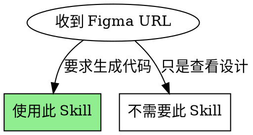
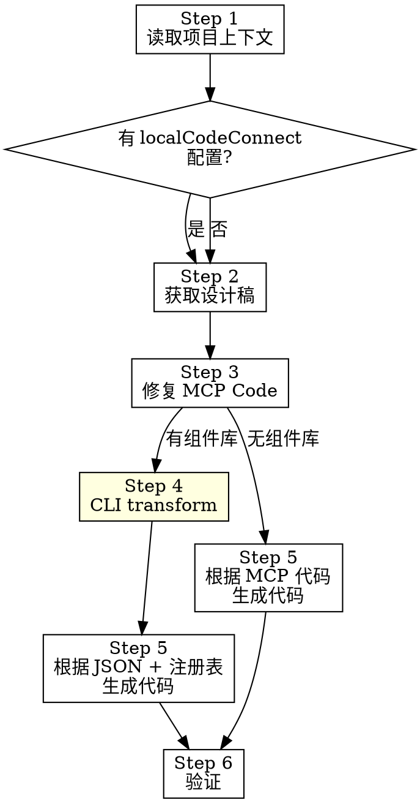

# Figma to Code

## 核心原则

**使用项目组件库生成代码，而非 Figma MCP 的原始输出。** MCP 返回的代码有语法问题且不使用项目组件，必须经过修复和转换。

## 前提条件

1. **Figma MCP 已连接**
2. **可选**：项目配置了 local-code-connect（有组件库时）
   - `package.json` 中有 `localCodeConnect.registry` 配置
   - 组件库已导出注册表文件

## 何时使用



## 流程概览



**黄色标注**：Step 4 仅在有组件库时执行。

## 流程

**必须按顺序执行，不允许跳过任何步骤。**

### Step 1: 读取项目上下文

在调用任何 Figma MCP 之前：

1. **读取 `package.json`**，检查是否有 `localCodeConnect.registry` 配置
2. **如果有配置**：读取组件注册表，了解可用组件及其 props
3. **分析项目结构**，了解现有代码布局和约定

```json
// package.json 配置示例（可选）
{
  "localCodeConnect": {
    "registry": "./node_modules/@xrs/vue/dist/.figma-registry.json"
  }
}
```

**两种模式**：
- **有组件库**：找到配置 → 后续使用 CLI transform（Step 4）
- **无组件库**：没有配置 → 跳过 Step 4，直接根据 MCP 代码生成

### Step 2: 获取设计稿信息

从 Figma URL 提取 fileKey 和 nodeId：
- URL 格式：`https://figma.com/design/:fileKey/:fileName?node-id=1-2`
- fileKey: `/design/` 后的部分
- nodeId: `node-id` 参数值

调用 Figma MCP：
```
get_design_context(fileKey=":fileKey", nodeId="1-2")
get_screenshot(fileKey=":fileKey", nodeId="1-2")
```

**截图是视觉验证的基准**，保留到最后。

### Step 3: 修复 MCP Code

MCP 返回的代码可能有语法问题。按照 `prompts/fix-mcp-code.md` 修复：

**修复规则**：
- 只修复语法问题，不改变语义
- 保留所有 `data-node-id`、`data-name` 属性
- 保留所有 `className`、样式信息
- 输出合法的 JSX 文件

将修复后的代码保存为临时文件：`/tmp/figma-fixed.jsx`

### Step 4: 转换为 JSON（仅当有组件库时）

**如果 Step 1 没有找到 `localCodeConnect.registry` 配置，跳过此步骤。**

使用 local-code-connect CLI 转换：

```bash
npx @xrs/local-code-connect transform /tmp/figma-fixed.jsx \
  --registry <registry路径> \
  -o /tmp/figma-result.json
```

**输出是 ComponentTree JSON**，包含：
- 匹配到的项目组件
- 组件 props
- 导入信息
- 组件树结构

### Step 5: 生成代码

**有组件库时**（有 Step 4 输出）：
1. **ComponentTree JSON**（Step 4 输出）
2. **组件注册表**（组件详细 props 和用法）
3. **项目结构**（现有代码和目录布局）

**无组件库时**（跳过了 Step 4）：
1. **修复后的 MCP 代码**（Step 3 输出）
2. **项目结构**（现有代码和目录布局）
3. 根据项目现有模式生成代码

**决策由你做出**：
- 创建新文件还是修改现有文件
- 文件放在哪个目录
- 是否拆分为多个组件
- 如何与现有代码集成

按照 `prompts/generate-code.md` 指南生成代码。

### Step 6: 验证

对比截图验证：
- [ ] 布局匹配（间距、对齐、尺寸）
- [ ] 排版匹配（字体、大小、粗细）
- [ ] 颜色匹配
- [ ] 使用了正确的项目组件

## 反模式

| 坏行为 | 为什么失败 | 正确做法 |
|--------|-----------|---------|
| 不检查 package.json 直接开始 | 不知道是否有组件库 | 必须先读 package.json |
| 有组件库却跳过 CLI transform | 组件映射不准确 | 有配置就必须用 CLI |
| 直接使用 MCP 返回的代码 | 语法错误 + 不符合项目规范 | 经过 Step 3 修复 |
| 不保存临时文件 | CLI 需要文件路径 | 保存为 /tmp/figma-*.jsx |
| 手动写组件映射 | 不准确、不一致 | 使用 CLI transform |
| 忽略组件注册表 | 生成的代码不符合项目规范 | 始终参考注册表 |

## 你可能想跳过部分步骤

| 借口 | 反驳 |
|------|------|
| "MCP 代码看起来没问题" | 语法问题可能很隐蔽，需要修复 |
| "这个组件很简单" | 简单组件更容易不一致 |
| "用户很急" | 返工比多花 2 分钟更慢 |
| "项目没有组件库，随便写" | 仍需遵循项目现有模式 |
| "CLI 太麻烦" | 有组件库时 CLI 保证映射准确 |

**必须完整执行流程。有组件库时 Step 1-6，无组件库时 Step 1-3, 5-6。**

## 资源

- `prompts/fix-mcp-code.md` - 修复 MCP 代码的详细指南
- `prompts/generate-code.md` - 生成最终代码的详细指南
- `examples/` - 各阶段输出示例

## 常见问题

### 项目没有 localCodeConnect 配置

说明项目没有使用组件库的 Code Connect 功能。这是正常的：
- 跳过 Step 4
- 在 Step 5 根据 MCP 代码和项目现有模式生成代码

### CLI transform 失败

通常是 JSX 语法问题。检查：
1. 修复后的代码是否能被 Babel 解析
2. 是否有未闭合的标签
3. 是否有非法字符

### 组件未匹配

注册表中没有对应组件。选择：
1. 使用最接近的项目组件
2. 保留原始 HTML 结构
3. 告知用户需要在组件库添加该组件

### 设计稿太大

`get_design_context` 返回截断。使用：
1. `get_metadata` 获取节点结构
2. 分别获取子节点的 design context
3. 分多次处理