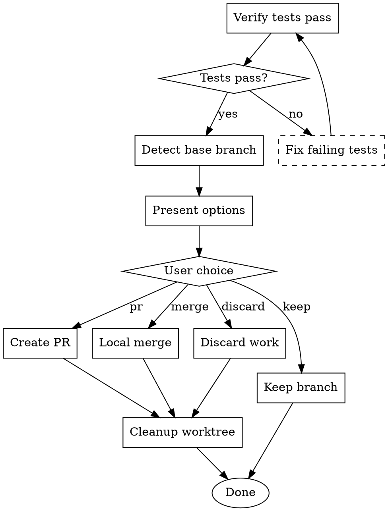

# Finishing a Development Branch

**Core principle:** Development isn't done until the branch is properly resolved.

Announce at start: "I'm using the finishing-a-development-branch skill to properly complete this work."

## When to Use

- All planned tasks completed
- All tests passing
- Code review approved
- Ready to merge or create PR

## Pre-Finish Verification

### 🔴 Must Verify Before Proceeding

```bash
# 1. All tests pass
npm test || yarn test || pnpm test
# Exit code must be 0

# 2. Build succeeds
npm run build || yarn build || pnpm build
# Exit code must be 0

# 3. No uncommitted changes
git status --porcelain
# Output must be empty

# 4. Branch is up to date with base
git fetch origin
git log HEAD..origin/main --oneline
# If commits exist, rebase required
```

**If any check fails: STOP. Do not proceed until fixed.**

## Workflow



## Step 1: Verify All Tests Pass

```bash
# Run full test suite
npm test 2>&1 | tee test-results.log

# Check exit code
if [ $? -ne 0 ]; then
    echo "❌ Tests failing. Cannot proceed."
    exit 1
fi

echo "✅ All tests pass"
```

**Tests not passing? STOP. Do not proceed. Fix the tests first.**

## Step 2: Detect Base Branch

```bash
# Method 1: Check git config
git config --get branch.$(git branch --show-current).merge

# Method 2: Find common ancestor
git merge-base --fork-point main HEAD 2>/dev/null || \
git merge-base --fork-point master HEAD 2>/dev/null || \
git merge-base --fork-point develop HEAD

# Method 3: Ask user if unclear
```

If base branch cannot be determined automatically, ask:
> "What branch should this be merged into? (main/master/develop/other)"

## Step 3: Check for Conflicts

```bash
# Fetch latest
git fetch origin

# Check if rebase needed
BEHIND=$(git rev-list HEAD..origin/main --count)
if [ "$BEHIND" -gt 0 ]; then
    echo "⚠️ Branch is $BEHIND commits behind. Rebase recommended."
    
    # Attempt rebase
    git rebase origin/main
    
    # If conflicts, alert user
    if [ $? -ne 0 ]; then
        echo "❌ Conflicts detected. Manual resolution required."
        git rebase --abort
        exit 1
    fi
fi
```

## Step 4: Present Options

Present these options to the user:

```markdown
## Branch Resolution Options

Your branch `feature/xyz` is ready. Choose an action:

### 1. 🔀 Local Merge
Merge directly into `main` locally, then push.
- Best for: Solo projects, small changes
- Command: `git checkout main && git merge feature/xyz`

### 2. 📬 Create Pull Request  
Push branch and create PR for review.
- Best for: Team projects, significant changes
- Command: `git push -u origin feature/xyz && gh pr create`

### 3. 🔖 Keep Branch
Leave branch as-is for later handling.
- Best for: Incomplete work, waiting for dependencies
- Action: No changes made

### 4. 🗑️ Discard Work
Delete branch and all changes (DESTRUCTIVE).
- Best for: Abandoned experiments, wrong approach
- Command: `git checkout main && git branch -D feature/xyz`

Which option? (1/2/3/4)
```

## Step 5: Execute Chosen Option

### Option 1: Local Merge

```bash
# Get current branch name
FEATURE_BRANCH=$(git branch --show-current)
BASE_BRANCH="main"  # or detected base

# Checkout base
git checkout $BASE_BRANCH

# Pull latest
git pull origin $BASE_BRANCH

# Merge feature branch
git merge $FEATURE_BRANCH --no-ff -m "Merge $FEATURE_BRANCH into $BASE_BRANCH"

# Push
git push origin $BASE_BRANCH

echo "✅ Merged $FEATURE_BRANCH into $BASE_BRANCH"
```

### Option 2: Create Pull Request

```bash
# Push branch
git push -u origin $(git branch --show-current)

# Create PR (using GitHub CLI)
if command -v gh &> /dev/null; then
    gh pr create --fill
else
    echo "📎 Create PR manually at:"
    echo "https://github.com/$(git remote get-url origin | sed 's/.*github.com[:/]\(.*\)\.git/\1/')/compare/$(git branch --show-current)"
fi
```

### Option 3: Keep Branch

```bash
echo "📌 Branch kept as-is: $(git branch --show-current)"
echo "Resume later with: git checkout $(git branch --show-current)"
```

### Option 4: Discard Work

**CONFIRM FIRST:**
> "⚠️ This will permanently delete all work on this branch. Are you sure? (yes/no)"

```bash
# Only proceed if confirmed
FEATURE_BRANCH=$(git branch --show-current)
git checkout main
git branch -D $FEATURE_BRANCH

echo "🗑️ Branch $FEATURE_BRANCH deleted"
```

## Step 6: Cleanup Worktree (if applicable)

If using git worktrees:

```bash
# Check if in worktree
if [ -f "$(git rev-parse --git-dir)/commondir" ]; then
    WORKTREE_PATH=$(pwd)
    
    # Return to main worktree
    cd $(git rev-parse --git-common-dir)/..
    
    # Remove worktree
    git worktree remove $WORKTREE_PATH
    
    echo "🧹 Worktree cleaned up"
fi
```

## Delivery Checklist

Before marking complete, verify:

- [ ] All tests passing (verified by running, not by memory)
- [ ] Coverage meets threshold (≥80% for production code)
- [ ] No security vulnerabilities (npm audit / safety check)
- [ ] Documentation updated (README, API docs, CHANGELOG)
- [ ] Branch resolved (merged, PR created, or explicitly kept)
- [ ] Worktree cleaned (if applicable)
- [ ] Human confirmed (for production merges)

## Red Flags

| Temptation | Response |
|------------|----------|
| "Tests are probably fine" | Run them. Verify. |
| "I'll create the PR later" | Create it now or explicitly choose "keep" |
| "The conflicts look simple" | Resolve them properly, don't force push |
| "Documentation can wait" | Update it now, part of definition of done |
| "It's just a small change" | Same process. No shortcuts. |

## Output Summary

After completion, provide:

```markdown
## Branch Resolution Summary

**Branch**: feature/user-auth
**Base**: main
**Action**: Merged locally ✅

### Verification
- Tests: ✅ 47/47 passing
- Coverage: ✅ 84%
- Build: ✅ Successful
- Audit: ✅ No vulnerabilities

### Changes Included
- 12 files changed
- +342 / -28 lines
- 5 commits

### Next Steps
- [x] Tests verified
- [x] Merged to main
- [x] Pushed to origin
- [ ] Monitor deployment (if auto-deploy enabled)
```

## Core Principles

1. **Tests must pass**: Not "probably" pass, actually pass
2. **No silent merges**: Always document what was merged and why
3. **Clean up after yourself**: Remove worktrees, delete merged branches
4. **Human in the loop**: For production, always get confirmation
5. **Definition of done**: Includes docs, tests, and proper resolution
