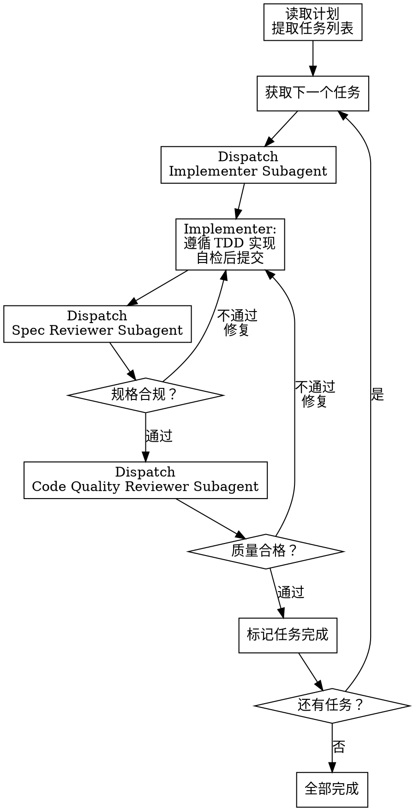

# Subagent-Driven Development

**来源**: PDForge
**类型**: 协作模式型 Skill

Announce at start: "I'm using the subagent-driven-development skill to ensure high-quality implementation through fresh-context subagents and two-stage review."

## Core Concept

每个任务分发给一个**全新上下文的子代理**执行：
- 子代理不知道其他任务的实现细节
- 子代理专注于当前任务
- 避免"上下文污染"导致的假设和捷径

每个任务完成后经过**两阶段审查**：
1. **规格合规审查** - 是否满足计划要求
2. **代码质量审查** - 是否符合最佳实践

## Workflow



## Why Two-Stage Review?

单一审查常遗漏问题：

| 问题类型 | 单一审查 | 两阶段审查 |
|----------|----------|------------|
| "代码写得好但不符合规格" | ❌ 常遗漏 | ✅ 规格审查捕获 |
| "符合规格但代码质量差" | ❌ 常遗漏 | ✅ 质量审查捕获 |
| "两者都有问题" | ⚠️ 可能只发现一个 | ✅ 分别发现 |

**顺序不可颠倒**：
1. 先确保**做对的事**（规格合规）
2. 再确保**把事做好**（代码质量）

## Subagent Roles

### 1. Implementer (实现者)

**职责**：按任务规格实现代码

```yaml
# 见 implementer-prompt.md
- 读取任务详情
- 遵循 TDD 实现
- 运行验证命令
- 自检后提交
```

### 2. Spec Reviewer (规格审查员)

**职责**：检查实现是否符合任务规格

```yaml
# 见 spec-reviewer-prompt.md
- 对照任务规格检查
- 不关心代码质量
- 只关心"是否做了规格要求的事"
```

### 3. Code Quality Reviewer (质量审查员)

**职责**：检查代码是否符合最佳实践

```yaml
# 见 code-quality-reviewer-prompt.md
- 检查代码质量
- 不关心是否符合规格（已经通过规格审查）
- 只关心"代码写得好不好"
```

## Orchestration Flow

```javascript
// 主 Agent (Orchestrator) 的执行逻辑

async function executeWithSubagents(planPath) {
  const plan = await readPlan(planPath);
  
  for (const task of plan.tasks) {
    let approved = false;
    
    while (!approved) {
      // 1. 分发给实现者
      const implementation = await dispatch('implementer', {
        task: task,
        projectContext: getMinimalContext()
      });
      
      // 2. 规格审查
      const specReview = await dispatch('spec-reviewer', {
        task: task,
        implementation: implementation
      });
      
      if (specReview.status !== 'PASS') {
        // 返回实现者修复
        continue;
      }
      
      // 3. 质量审查
      const qualityReview = await dispatch('code-quality-reviewer', {
        implementation: implementation
      });
      
      if (qualityReview.status !== 'PASS') {
        // 返回实现者修复
        continue;
      }
      
      approved = true;
    }
    
    markTaskComplete(task.id);
  }
}
```

## When to Use

<examples>
<example>
Context: 计划已创建，需要高质量实现
user: "按计划实现功能，使用高质量模式"
assistant: "我将使用 subagent-driven-development skill，每个任务独立实现并经过两阶段审查..."
<commentary>高质量要求 → 使用 subagent-driven-development</commentary>
</example>

<example>
Context: 1→100 产品开发
user: "这是生产环境的功能，需要严格质量控制"
assistant: "使用 subagent-driven-development 确保每个任务都经过规格和质量双重审查..."
<commentary>生产环境 → 使用 subagent-driven-development</commentary>
</example>

<example>
Context: 0→1 产品，需要快速迭代
user: "MVP 阶段，快速实现就好"
assistant: "对于 MVP，建议使用 executing-plans skill 而不是 subagent-driven-development..."
<commentary>MVP 阶段 → 推荐 executing-plans</commentary>
</example>
</examples>

## Integration with TDD

Implementer Subagent **必须** 遵循 test-driven-development skill：

```
┌─────────────────────────────────────────────────────────────┐
│  Implementer Subagent 内部流程                               │
│                                                             │
│  ┌─────────────────────────────────────────────────────┐    │
│  │  test-driven-development skill                      │    │
│  │                                                     │    │
│  │  🔴 RED: 写失败测试                                  │    │
│  │     ↓                                               │    │
│  │  🟢 GREEN: 写最小代码                               │    │
│  │     ↓                                               │    │
│  │  ♻️ REFACTOR: 改进设计                              │    │
│  │     ↓                                               │    │
│  │  📝 COMMIT: 提交代码                                │    │
│  │                                                     │    │
│  └─────────────────────────────────────────────────────┘    │
│                                                             │
└─────────────────────────────────────────────────────────────┘
```

## Comparison with executing-plans

| 维度 | subagent-driven-development | executing-plans |
|------|----------------------------|-----------------|
| 适用场景 | 1→100 产品，高质量要求 | 0→1 产品，快速验证 |
| 执行方式 | 每任务新子代理 | 同一 Agent 批量执行 |
| 审查频率 | 每任务两阶段审查 | 检查点时审查 |
| 上下文 | 子代理隔离 | 共享上下文 |
| 速度 | 较慢（多次审查） | 较快（批量执行） |
| 质量保证 | 高（独立审查） | 中（检查点审查） |

## Output Format

```markdown
## Subagent-Driven Development 执行报告

**计划**: [计划文档路径]
**任务总数**: 5
**已完成**: 3
**当前任务**: T004

### 任务执行记录

#### T001: 创建 User 模型
- **Implementer**: ✅ 完成
- **Spec Review**: ✅ 通过
- **Quality Review**: ✅ 通过
- **状态**: 完成

#### T002: 实现注册 API
- **Implementer**: ✅ 完成
- **Spec Review**: 🔴 未通过 (缺少邮箱验证)
- **Implementer (修复)**: ✅ 完成
- **Spec Review (重审)**: ✅ 通过
- **Quality Review**: ✅ 通过
- **状态**: 完成 (1 次返工)

#### T003: 实现登录 API
- **Implementer**: ✅ 完成
- **Spec Review**: ✅ 通过
- **Quality Review**: 🟡 部分通过 (建议改进错误处理)
- **Implementer (改进)**: ✅ 完成
- **Quality Review (重审)**: ✅ 通过
- **状态**: 完成 (1 次返工)

#### T004: 实现 JWT 中间件
- **Implementer**: 🔄 进行中
- **状态**: 执行中
```

## Key Principles

1. **上下文隔离** - 每个子代理从新鲜上下文开始，避免假设
2. **专业分工** - 实现者专注实现，审查员专注审查
3. **两阶段审查** - 先规格后质量，顺序不可颠倒
4. **循环修复** - 审查不通过则返回修复，直到通过
5. **TDD 纪律** - 实现者必须遵循 TDD

## Related Files

- `implementer-prompt.md` - 实现者子代理提示词
- `spec-reviewer-prompt.md` - 规格审查员提示词
- `code-quality-reviewer-prompt.md` - 质量审查员提示词
