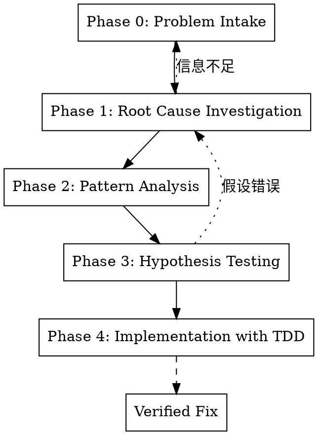

# Systematic Debugging

你遇到了一个问题。先别急着改代码——**系统性调试是一种纪律，不是建议**。

实测数据：**系统性方法 15-30 分钟修复，随机修复方法 2-3 小时折腾**。

Announce at start: "I'm using the systematic-debugging skill to investigate this issue methodically."

## When to Use

- 测试失败且原因不明显
- 代码"应该工作"但就是不工作
- 问题时有时无（间歇性问题）
- 修了一个 bug 又冒出新 bug
- "我不知道为什么会这样"

## The Iron Law

```
┌─────────────────────────────────────────────────────────────┐
│                                                             │
│    未完成 Phase 1 之前，禁止提出任何修复方案                   │
│                                                             │
│    NO FIX PROPOSALS BEFORE PHASE 1 COMPLETION               │
│                                                             │
└─────────────────────────────────────────────────────────────┘
```

这不可协商。这不是建议。你不能为自己绕过这条规则找理由。

## 4+1 Phase Framework



---

## Phase 0: Problem Intake（问题收集）

**目的**：收集足够信息，而非急于诊断

### 必须收集的信息

- [ ] **确切错误信息**：完整的错误输出，不是"它报错了"
- [ ] **复现步骤**：如何可靠地重现问题？
- [ ] **预期行为 vs 实际行为**：应该发生什么？实际发生了什么？
- [ ] **最近更改**：问题出现前改了什么？
- [ ] **环境信息**：Node 版本、操作系统、依赖版本

### Checklist

```markdown
□ 我有完整的错误信息/堆栈跟踪
□ 我能可靠地重现问题
□ 我知道预期行为是什么
□ 我知道问题首次出现的时间/提交
□ 我了解相关的环境配置
```

### Detection Commands

```bash
# 获取完整错误信息
npm test 2>&1 | tee error.log

# 查看最近更改
git log --oneline -10
git diff HEAD~3

# 环境信息
node -v && npm -v
cat package.json | jq '.dependencies'
```

**⚠️ 如果无法收集完整信息，停在这里，先问问题获取更多信息。**

---

## Phase 1: Root Cause Investigation（根因调查）

**目的**：找到问题的根本原因，而非表面症状

### 关键约束

| 允许 | 禁止 |
|------|------|
| 添加日志观察 | 修改业务逻辑 |
| 阅读代码理解流程 | 提出修复方案 |
| 追踪调用栈 | "试试这个能不能修好" |
| 形成假设 | 实施任何修复 |

### 调查技术

#### 1. 调用栈追踪

```bash
# 添加临时调试日志
console.log('[DEBUG] Function X called with:', args);
console.log('[DEBUG] State before:', state);
console.log('[DEBUG] State after:', newState);
```

#### 2. 二分法定位

```bash
# 找到引入问题的提交
git bisect start
git bisect bad HEAD
git bisect good <last_known_good_commit>
# 然后运行测试判断好坏
```

#### 3. 最小复现

- 创建最小化的测试用例
- 移除所有无关代码
- 确定问题的最小触发条件

### 输出要求

完成 Phase 1 后，必须能回答：

```markdown
## Root Cause Analysis

**问题是什么**:
[一句话描述问题本质]

**根因是什么**:
[问题的根本原因，不是表面症状]

**证据是什么**:
[支持这个结论的具体证据]

**为什么会发生**:
[解释为什么会出现这个根因]
```

**只有能回答以上问题后，才能进入 Phase 2。**

---

## Phase 2: Pattern Analysis（模式分析）

**目的**：识别问题的模式和规律

### 分析维度

#### 时间维度
- 问题是否与特定时间/顺序相关？
- 是否是竞态条件或时序问题？

#### 数据维度
- 问题是否只在特定输入下出现？
- 边界值、空值、特殊字符是否触发问题？

#### 环境维度
- 问题是否只在特定环境下出现？
- 开发/测试/生产环境表现是否不同？

#### 依赖维度
- 问题是否与外部依赖相关？
- API 调用、数据库、文件系统？

### Detection Commands

```bash
# 查找相似问题
grep -rn "相关关键词" --include="*.ts" src/

# 检查是否有类似的代码模式
ast-grep -p '类似模式'

# 查看相关文件的修改历史
git log --follow -p -- src/problematic/file.ts
```

---

## Phase 3: Hypothesis Testing（假设测试）

**目的**：验证假设，一次只测试一个

### 假设测试原则

```
┌─────────────────────────────────────────────────────────────┐
│                                                             │
│    一次只测试一个假设                                         │
│    ONE HYPOTHESIS AT A TIME                                 │
│                                                             │
│    如果同时改多处，就不知道是哪个修复了问题                     │
│                                                             │
└─────────────────────────────────────────────────────────────┘
```

### 假设记录模板

```markdown
## Hypothesis #1

**假设**: [如果 X，那么 Y]

**测试方法**: [如何验证这个假设]

**预期结果**: [如果假设正确会看到什么]

**实际结果**: [实际看到了什么]

**结论**: ✅ 验证 / ❌ 否定 / ⚠️ 部分验证
```

### 假设测试流程

1. **形成假设**：基于 Phase 1-2 的分析
2. **设计测试**：最小化的验证方法
3. **执行测试**：只改一处，观察结果
4. **记录结果**：无论成功失败都记录
5. **更新理解**：基于结果调整假设

---

## Phase 4: Implementation with TDD（TDD 实现修复）

**目的**：用 TDD 方式实现修复，确保不引入新问题

### 修复流程


### 修复 Checklist

```markdown
□ 写了复现问题的测试（先确认测试失败）
□ 修复代码最小化（只改必要的部分）
□ 复现测试现在通过
□ 所有相关测试通过
□ 没有引入新的失败测试
□ 覆盖率没有下降
□ 清理了调试代码（console.log 等）
```

### Verification Commands

```bash
# 运行新增的测试
npm test -- --grep "新增测试名"

# 运行所有测试
npm test

# 检查覆盖率
npm run coverage

# 确保没有遗留调试代码
grep -rn "console.log\|debugger" --include="*.ts" src/ | grep -v ".test.ts"
```

---

## Red Flags（反合理化）

| 想法 | 现实 |
|------|------|
| "我知道问题在哪，直接修就行" | 不。完成 Phase 0-1，验证你的假设 |
| "这个简单，不需要这么系统" | 越"简单"的问题越容易掉进陷阱 |
| "先试试这个修复，不行再说" | 猜测-检查循环效率最低 |
| "我已经花了很多时间了" | 沉没成本不是跳过流程的理由 |
| "这个问题肯定是 X 导致的" | "肯定"是红旗词——用证据验证 |
| "我同时测试几个假设，节省时间" | 同时改多处就不知道是哪个修复了 |

---

## Common Debugging Patterns

### Pattern 1: 异步/竞态问题

**症状**：测试有时过有时失败

**调查方向**：
```bash
# 查找没有 await 的异步调用
grep -rn "async\|await\|Promise" --include="*.ts" src/
```

参考：`condition-based-waiting.md`

### Pattern 2: 状态污染

**症状**：测试单独运行通过，一起运行失败

**调查方向**：
```bash
# 查找全局状态
grep -rn "let \|var " --include="*.ts" src/ | grep -v "const"
```

### Pattern 3: 边界条件

**症状**：特定输入导致失败

**调查方向**：
- 空值/undefined
- 边界数值（0, -1, MAX_INT）
- 空数组/空对象
- 特殊字符

参考：`defense-in-depth.md`

### Pattern 4: 依赖问题

**症状**：本地通过，CI 失败（或反过来）

**调查方向**：
```bash
# 检查依赖版本
npm ls
diff package-lock.json <previous-version>
```

---

## Related Files

- `root-cause-tracing.md` - 详细的调用栈追踪技术
- `defense-in-depth.md` - 多层验证策略
- `condition-based-waiting.md` - 条件轮询替代任意超时

---

## Quick Reference Card

```
┌─────────────────────────────────────────────────────────────┐
│                 SYSTEMATIC DEBUGGING                        │
├─────────────────────────────────────────────────────────────┤
│                                                             │
│  Phase 0: INTAKE          "我收集了什么信息？"               │
│           ↓               错误信息 + 复现步骤 + 预期/实际    │
│                                                             │
│  Phase 1: INVESTIGATE     "根因是什么？"                    │
│           ↓               ⚠️ 禁止提出修复方案               │
│                                                             │
│  Phase 2: ANALYZE         "有什么模式？"                    │
│           ↓               时间/数据/环境/依赖维度            │
│                                                             │
│  Phase 3: HYPOTHESIZE     "假设是什么？"                    │
│           ↓               一次只测试一个假设                │
│                                                             │
│  Phase 4: FIX with TDD    "怎么修复？"                      │
│                           先测试失败 → 最小修复 → 全部通过   │
│                                                             │
└─────────────────────────────────────────────────────────────┘
```

## Core Principle

> **"The purpose of debugging is to understand, not to fix."**
>
> 调试的目的是理解，而非修复。理解了问题，修复自然而然。
> 
> 不理解就修复，只会制造更多问题。
