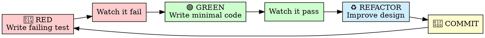

# Test-Driven Development

**来源**: PDForge
**类型**: 纪律强制型 Skill

Announce at start: "I'm using the test-driven-development skill to ensure code quality through test-first methodology."

## Iron Law (铁律)

```
╔═══════════════════════════════════════════════════════════════════════════╗
║                                                                           ║
║   NO CODE WITHOUT A FAILING TEST FIRST                                    ║
║   先测试失败，后写代码。没有例外。                                           ║
║                                                                           ║
╚═══════════════════════════════════════════════════════════════════════════╝
```

This is not a suggestion. This is not a guideline. This is a **law**.

## RED-GREEN-REFACTOR Cycle



### Phase Details

| Phase | 做什么 | 禁止什么 |
|-------|--------|----------|
| 🔴 RED | 写一个会失败的测试 | 写任何实现代码 |
| 👀 WATCH FAIL | 运行测试，确认失败 | 跳过这步 |
| 🟢 GREEN | 写**最小**代码让测试通过 | 写"顺便"的代码 |
| 👀 WATCH PASS | 运行测试，确认通过 | 跳过这步 |
| ♻️ REFACTOR | 改进代码设计 | 改变行为、破坏测试 |
| 📝 COMMIT | 提交通过的代码 | 提交红灯代码 |

## Red Flags List (反合理化清单)

**这些是 AI 可能找的借口——全部无效：**

| AI 可能的借口 | 为什么是借口 | 正确做法 |
|--------------|-------------|----------|
| "这个改动很简单，不需要测试" | 简单的改动也会引入 bug | 写测试 |
| "我已经手动测试过了" | 手动测试不可重复 | 写自动化测试 |
| "测试后置也能达到同样目的" | 测试后置会遗漏边缘情况 | 先写测试 |
| "这只是配置/文档改动" | 配置错误也是 bug | 写配置测试 |
| "现有测试已经覆盖了" | 真的吗？证明它 | 运行测试确认 |
| "时间紧迫，先实现再补测试" | 补测试的债很少还 | 先写测试 |
| "这个情况不一样因为..." | 没有不一样的情况 | 先写测试 |
| "代码已经写好了，保留作参考" | 参考会变成最终代码 | 删除它 |
| "我只是先探索一下" | 探索不需要写实现代码 | 删除实现，保留测试 |

### The Rule (规则)

```markdown
Write code before test? Delete it.
先写代码后写测试？删除它。

Don't keep it as "reference".
不要保留作"参考"。

Don't "adapt" it while writing tests.
不要一边写测试一边"调整"它。

Delete means delete.
删除意味着删除。
```

## Workflow Checklist

### Before Writing Any Code

- [ ] 有没有对应的测试？
- [ ] 测试是否先运行并失败了？
- [ ] 失败原因是否符合预期（不是因为其他原因失败）？

### After Writing Code

- [ ] 测试现在通过了吗？
- [ ] 只改了让测试通过的最小代码吗？
- [ ] 需要重构吗？
- [ ] 重构后测试还是绿的吗？

## Testing Patterns

### For New Features

```typescript
// 1. 先写测试（会失败）
describe('UserService', () => {
  describe('register', () => {
    it('should create user with valid email', async () => {
      const user = await userService.register({
        email: 'test@example.com',
        password: 'password123'
      });
      
      expect(user.id).toBeDefined();
      expect(user.email).toBe('test@example.com');
    });
  });
});

// 2. 运行测试 → 🔴 失败（因为 register 方法不存在）

// 3. 写最小实现
class UserService {
  async register(data: { email: string; password: string }) {
    const user = await this.userRepo.create(data);
    return user;
  }
}

// 4. 运行测试 → 🟢 通过

// 5. 重构（如果需要）
```

### For Bug Fixes

```typescript
// 1. 先写复现 bug 的测试
it('should handle empty email gracefully', () => {
  expect(() => userService.register({ email: '', password: '123' }))
    .toThrow('Email is required');
});

// 2. 运行测试 → 🔴 失败（bug 确实存在）

// 3. 修复 bug
async register(data: { email: string; password: string }) {
  if (!data.email) throw new Error('Email is required');
  // ...
}

// 4. 运行测试 → 🟢 通过

// 5. Bug 已修复且有回归测试保护
```

### For Refactoring

```typescript
// 1. 确保现有测试覆盖要重构的代码
// 运行覆盖率检查
npx jest --coverage --collectCoverageFrom='src/target/**'

// 2. 如果覆盖不足，先补充测试

// 3. 开始重构，保持测试绿色

// 4. 每次小改动后运行测试
```

## Integration with Other Components

```
┌─────────────────────────────────────────────────────────────┐
│                    TDD Skill 集成                           │
│                                                             │
│  writing-plans                                              │
│       │                                                     │
│       ▼                                                     │
│  ┌─────────────────────────────────────────────────────┐    │
│  │  test-driven-development (本 Skill)                 │    │
│  │  ├── implementer agent 必须遵循                      │    │
│  │  ├── tdd-guide agent 指导遵循                        │    │
│  │  └── code-reviewer 检查是否遵循                      │    │
│  └─────────────────────────────────────────────────────┘    │
│       │                                                     │
│       ▼                                                     │
│  requesting-code-review                                     │
│                                                             │
└─────────────────────────────────────────────────────────────┘
```

## Coverage Requirements

| 产品阶段 | 最低覆盖率 | 说明 |
|----------|-----------|------|
| 0→1 MVP | 50% | 核心路径必须覆盖 |
| 1→100 Production | 80% | 全面覆盖 |

**检查命令**：
```bash
# JavaScript/TypeScript
npx jest --coverage

# Python
pytest --cov=src --cov-fail-under=80

# Go
go test -cover ./...
```

## Common Mistakes to Avoid

### ❌ 错误：写"预期通过"的测试

```typescript
// 这不是 TDD！这是测试后置
function add(a, b) { return a + b; }

// 后写的测试
it('should add', () => {
  expect(add(1, 2)).toBe(3); // 当然通过，你已经知道实现了
});
```

### ✅ 正确：写"预期失败"的测试

```typescript
// 先写测试
it('should add two numbers', () => {
  expect(add(1, 2)).toBe(3); // 🔴 会失败，因为 add 不存在
});

// 后写实现
function add(a, b) { return a + b; } // 🟢 现在通过
```

### ❌ 错误：测试实现细节

```typescript
// 不要测试实现细节
it('should call hash function', () => {
  const spy = jest.spyOn(bcrypt, 'hash');
  await userService.register(data);
  expect(spy).toHaveBeenCalled();
});
```

### ✅ 正确：测试行为

```typescript
// 测试行为/结果
it('should store password securely', async () => {
  const user = await userService.register({ password: 'plain' });
  expect(user.password).not.toBe('plain');
});
```

## Key Reminders

1. **测试先行** = 设计先行。写测试时你在思考 API 应该长什么样。

2. **最小代码** = 避免过度设计。只写让测试通过的代码。

3. **红灯是好事** = 红灯证明测试在工作，而不是假绿。

4. **重构有保护** = 绿灯后重构，测试保护你不会破坏功能。

5. **删除是解脱** = 先写的代码是负债。删掉它，从测试开始。

---

**Remember**: If you wrote code before writing a test, **DELETE IT**. This is not negotiable.
