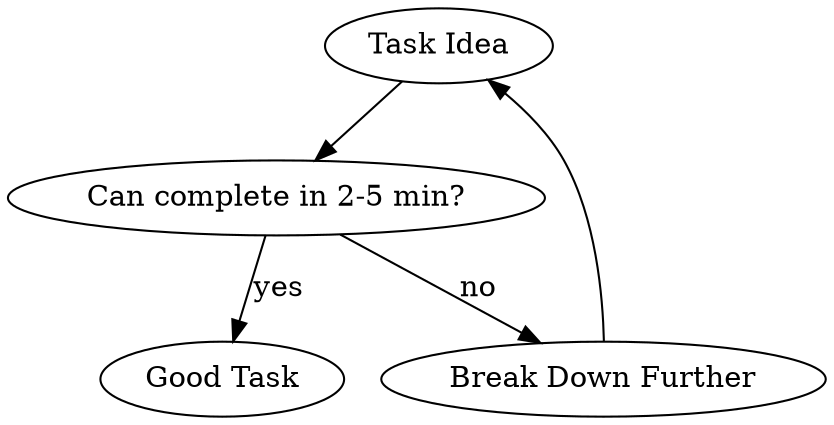
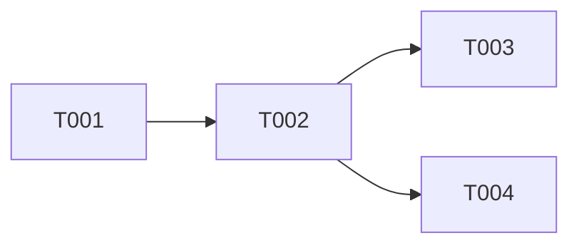

# Writing Plans

**Core Principle**: Plans should be executable by someone with "zero project context, poor judgment, and an aversion to writing tests."

Announce at start: "I'm using the writing-plans skill to create a detailed implementation plan."

## When to Use

- Before implementing any feature with more than one file change
- When PRD or design is approved and ready for execution
- When breaking down complex work for subagent execution
- When handoff to another engineer/session is needed

## The 2-5 Minute Rule

**Every task must be completable in 2-5 minutes.**

This is the most important constraint. If a task takes longer, it's not detailed enough.



## What Makes a Good Task

### ✅ Must Have

| Element | Bad Example | Good Example |
|---------|-------------|--------------|
| **Precise File Path** | "Update the user module" | `src/models/user.ts` |
| **Complete Code** | "Add validation" | Full function with all validation logic |
| **Verification** | "Make sure it works" | `npm test -- --grep "User.validate"` |
| **Estimate** | "Shouldn't take long" | "3 min" |
| **Dependencies** | "After the other stuff" | "Depends on: T001, T002" |

### ❌ Red Flags in Task Descriptions

These phrases indicate the task is too vague:

| Red Flag Phrase | Problem | Fix |
|-----------------|---------|-----|
| "Add appropriate validation" | What validation? | List every validation rule with code |
| "Handle errors gracefully" | How exactly? | Show the try/catch with specific errors |
| "Follow existing patterns" | Which pattern? | Paste the actual pattern code |
| "Similar to X" | Different how? | Show the adapted code |
| "Update as needed" | Ambiguous | List every update explicitly |
| "Implement the rest" | Undefined scope | Enumerate every item |

## Task Template

```markdown
### T001: [Descriptive Action + Target]

**File**: `exact/path/to/file.ts`
**Action**: Create | Modify | Delete
**Estimate**: [2-5] min
**Dependencies**: [T000] or None

**Context**: [One sentence why this task exists]

**Code**:
```typescript
// COMPLETE, WORKING CODE
// Not pseudo-code
// Not "add logic here"
// The actual implementation
```

**Verification**:
```bash
# Command that proves success
npx tsc --noEmit
npm test -- --grep "specific test"
```

**Success Criteria**:
- [ ] File exists/modified
- [ ] TypeScript compiles
- [ ] Tests pass
```

## Task Ordering Strategy

```
Layer 1: Foundation (Data Models, Types, Schemas)
    ↓
Layer 2: Core Logic (Services, Business Rules)
    ↓
Layer 3: Interface (API Endpoints, Controllers)
    ↓
Layer 4: Presentation (UI Components)
    ↓
Layer 5: Integration (E2E Tests, Deployment)

⚠️ Tests are written AT EACH LAYER, not at the end!
```

## Plan Document Structure

```markdown
# [Feature] Implementation Plan

**Source**: [PRD link]
**Created**: [date]
**Total Estimate**: [X tasks, ~Y minutes]

## Overview
[2-3 sentences from PRD]

## Technical Decisions
[Key architectural choices made]

## Dependencies
[External dependencies or prerequisites]

## Task Graph


## Tasks

### T001: ...
### T002: ...

## Verification Checklist
- [ ] All tasks complete
- [ ] All tests passing
- [ ] PRD acceptance criteria met
```

## Common Mistakes

### Mistake 1: Task Too Big

```markdown
❌ BAD:
### T001: Implement user authentication
**Estimate**: 30 min

✅ GOOD:
### T001: Create User interface
**Estimate**: 2 min
### T002: Create password hashing utility
**Estimate**: 3 min
### T003: Create User.validatePassword method
**Estimate**: 3 min
### T004: Add user authentication test
**Estimate**: 3 min
```

### Mistake 2: Missing Code

```markdown
❌ BAD:
**Code**: Implement validation for email and password

✅ GOOD:
**Code**:
```typescript
function validateUser(input: unknown): ValidationResult {
  const errors: string[] = [];
  
  if (!input || typeof input !== 'object') {
    return { valid: false, errors: ['Invalid input'] };
  }
  
  const { email, password } = input as Record<string, unknown>;
  
  if (!email || typeof email !== 'string') {
    errors.push('Email is required');
  } else if (!/^[^\s@]+@[^\s@]+\.[^\s@]+$/.test(email)) {
    errors.push('Email format is invalid');
  }
  
  if (!password || typeof password !== 'string') {
    errors.push('Password is required');
  } else if (password.length < 8) {
    errors.push('Password must be at least 8 characters');
  }
  
  return { valid: errors.length === 0, errors };
}
```
```

### Mistake 3: Vague Verification

```markdown
❌ BAD:
**Verification**: Run tests

✅ GOOD:
**Verification**:
```bash
# Type check
npx tsc --noEmit

# Run specific test
npm test -- --grep "validateUser"

# Expected output:
#   ✓ returns valid for correct input
#   ✓ returns error for missing email
#   ✓ returns error for invalid email format
#   ✓ returns error for short password
```
```

## Execution Modes

After writing the plan, ask the user which execution mode they prefer:

### Option A: Subagent-Driven Development (1→100 products)
- Each task executed by a fresh subagent
- Two-stage review after each task (spec + quality)
- Higher quality, slower execution

### Option B: Executing-Plans (0→1 products)
- Batch execution with checkpoints
- Review at milestones, not every task
- Faster iteration, acceptable for MVPs

## Checklist Before Finalizing Plan

- [ ] Every task is 2-5 minutes maximum
- [ ] Every task has complete, working code
- [ ] Every task has a specific verification command
- [ ] No vague language ("appropriate", "as needed", "similar to")
- [ ] Dependencies form a valid DAG (no cycles)
- [ ] A junior engineer could execute without questions
- [ ] Plan saved to `docs/plans/YYYY-MM-DD-<feature>.md`
